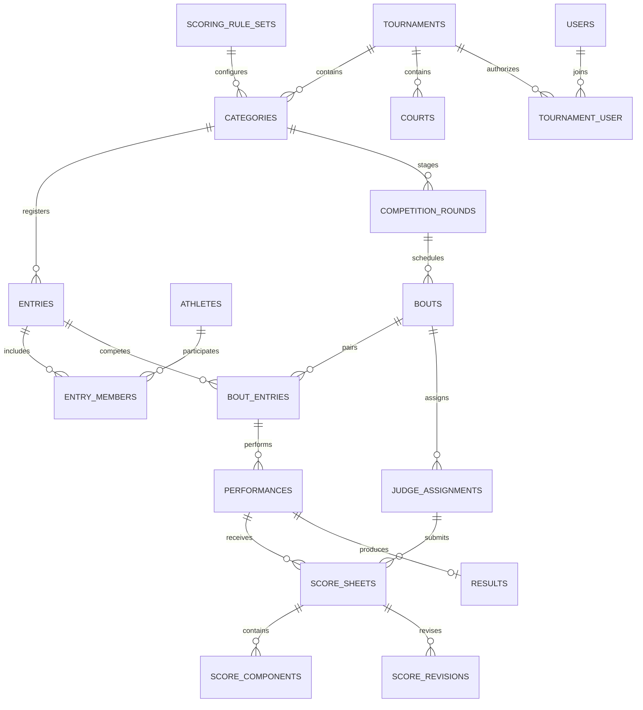

# پومسه | زیرساخت سامانهٔ مسابقات

Laravel 13 + Inertia 3 + Vue 3، با PHP 8.4 و Node 22 در محیط فعلی.

این نسخه مسیر پایلوت برگزاری **پومسهٔ استاندارد انفرادی با ۵ یا ۷ داور** را از ثبت‌نام تا پایان مسابقه پیاده می‌کند. مبنای دامنه، دو سند اولیه و اولویت اعلام‌شدهٔ کاربر است. تیمی، ابداعی و اجرای همزمان هنوز فعال نیستند. قوانین محاسبه در زمان تعریف رده توسط برگزارکننده انتخاب و تأیید می‌شوند؛ این تأیید به معنی گواهی انطباق با آیین‌نامهٔ رسمی نیست.

## اجرای سریع در Windows / PowerShell

از پوشهٔ `poomsae-system`:

```powershell
composer install
npm ci
# فقط در نصب جدید و وقتی .env وجود ندارد:
Copy-Item .env.example .env
php artisan key:generate
# اگر فایل دیتابیس SQLite وجود ندارد:
New-Item -ItemType File -Path database/database.sqlite
php artisan migrate
php artisan app:create-admin admin@example.com --name="مدیر سامانه"
npm run build
php artisan serve --host=127.0.0.1 --port=8000
```

در نصب فعلی، وابستگی‌ها نصب، migrationها اجرا و build ساخته شده‌اند؛ فایل .env و کلید برنامه موجودند. دستورات کپی .env و key:generate را روی نصب موجود اجرا نکنید. برای استفاده کافی است اولین مدیر را با دستور بالا بسازید و سرور را اجرا کنید. رمز در ترمینال به‌صورت مخفی دریافت می‌شود و باید دست‌کم ۱۲ کاراکتر داشته باشد؛ حساب یا رمز پیش‌فرض وجود ندارد.

آدرس: http://127.0.0.1:8000

برای توسعهٔ فرانت‌اند، در ترمینال جدا `npm run dev` اجرا کنید. برای پردازش صف، `php artisan queue:work --tries=3`. توسعهٔ اولیه با SQLite، صف دیتابیسی و broadcast از نوع log، به سرویس خارجی نیاز ندارد. فونت و asset از CDN دریافت نمی‌شود.

دادهٔ آزمایشی اختیاری، بعد از ساخت مدیر:

```powershell
php artisan db:seed --class=DemoSeeder
```

Seeder فقط در local/testing کار می‌کند، تکرارپذیر است و مسابقه، زمین، رده و دو ورزشکار فرضی می‌سازد. هیچ قانون داوری تأییدشده یا نمرهٔ رسمی ایجاد نمی‌کند. `DatabaseSeeder` به‌طور پیش‌فرض حسابی نمی‌سازد.

## قابلیت‌های پیاده‌شده

- ورود/خروج وب، کنترل نقش مدیر/اپراتور/داور/نمایشگر در هر مسابقه و API توکن Sanctum.
- تعریف زمین، افزودن حساب داور/اپراتور/نمایشگر، تعریف ردهٔ استاندارد انفرادی و دو فرم ثابت.
- ثبت ورزشکار، کنترل سن در تاریخ شروع و جنسیت رده، تأیید حضور/انصراف قبل از قرعه.
- تک‌حذفی تا ۶۴ نفر با bye و صعود دوربه‌دور؛ دورهای تا ۱۶ نفر با هر جفت دقیقاً یک بار.
- انتخاب دقیق ۵/۷ داور فعال برای هر دور؛ تخصیص صندلی مطابق ترتیب انتخاب.
- پنل اپراتور: شروع، پایان، مشاهدهٔ نمرات و تأیید نهایی هر فرم. یک اجرای باز در هر زمین؛ جلوگیری از داوری همزمان یک داور.
- مرکز کنترل پرکنتراست با الگوی نمایش حرفه‌ای سالن، وضعیت Mercure/SSE، حضور زندهٔ هر صندلی داوری و رنگ‌های مجزای چونگ/هونگ.
- ثبت اضطراری نمره به‌جای داور قطع‌شده فقط توسط مدیر/اپراتور، با دلیل اجباری، هویت ثبت‌کننده، revision و audit کامل.
- پنل داور: نمرهٔ دقت/اجرا، اصلاح با دلیل قبل از تأیید، مخفی‌بودن نمرات سایر داوران.
- شناسهٔ درخواست idempotent، کنترل نسخهٔ اجرا و revision نمره، تاریخچهٔ تغییرات و audit.
- محاسبهٔ هر مؤلفه با اعداد صحیح؛ حذف اختیاری یک کمینه/بیشینه به صورت مستقل؛ مجموع میانگین‌ها و سپس میانگین دو فرم.
- تساوی با تصمیم اپراتور و دلیل؛ انصراف/عدم حضور پس از قرعه با تأیید صریح، لغو اجراهای تأییدنشده و ثبت برنده.
- نمایشگر سالن فقط با نتایج منتشرشده، تایمر سپری‌شده، انتخاب زمین و هشدار توقف دریافت داده.
- خروجی CSV سازگار با Excel با محافظت در برابر formula injection.
- پایان مسابقه فقط پس از پایان تمام رده‌ها و فینال‌های تک‌حذفی.
- polling هر ۲ ثانیه برای داور/نمایشگر و میز اجرا؛ اتصال Mercure/SSE برای تازه‌سازی فوری، با polling به‌عنوان پشتیبان.

## اجرای یک مسابقه از داخل پنل

با بازکردن هر مسابقه، مدیر یا اپراتور مستقیماً وارد **مرکز کنترل روز مسابقه** می‌شود. این صفحه اجرای جاری هر زمین، پنج اجرای بعدی، صندلی‌های داوری که نمره داده‌اند یا هنوز باقی مانده‌اند و اکشن مجاز بعدی را نشان می‌دهد. آماده‌سازی از دکمهٔ جداگانه در بالای همین صفحه باز می‌شود.

1. با مدیر وارد شوید و مسابقه را بسازید.
2. در «آماده‌سازی»، زمین و حداقل ۵ یا ۷ داور اضافه کنید. برای حساب جدید رمز حداقل ۱۲ کاراکتر وارد کنید؛ حساب موجود فقط عضو می‌شود و رمز آن تغییر نمی‌کند. نقش حساب نمایشگر دسترسی مدیریت ندارد.
3. رده را بسازید: مدل برگزاری، سن/جنسیت، تعداد داور، دو نام فرم و تنظیمات محاسبه. سقف دقت و اجرا مجموعاً ۱۰ است. گزینهٔ حذف نمره و تأیید روش محاسبه اجباری به‌صورت روشن نمایش داده می‌شوند.
4. در «رده‌ها و میز اجرا»، ورزشکاران را ثبت کنید. حضور یا انصراف تمام ثبت‌نام‌شدگان را مشخص کنید؛ فقط حاضرها وارد قرعه می‌شوند.
5. زمین و پنل داور را انتخاب و جدول را بسازید. این عمل فقط یک بار برای هر دور ممکن است و فهرست رده را قفل می‌کند.
6. داوران با حساب خود وارد «پنل داور» شوند؛ حساب نمایشگر، «نمایشگر سالن» را باز کند.
7. اپراتور «شروع اجرا» و سپس «پایان اجرا و دریافت نمره» را می‌زند. داوران نمره را ارسال می‌کنند. بعد از دریافت همهٔ نمرات، اپراتور «تأیید نهایی و انتشار» را می‌زند.
8. دو فرم هر ورزشکار را تکمیل کنید. برنده بر اساس میانگین دو فرم تعیین می‌شود؛ تساوی نیازمند انتخاب برنده و دلیل از سوی سرداور/اپراتور است.
9. اگر ورزشکاری پس از قرعه انصراف داد، از بخش «انصراف یا عدم حضور» برنده، دلیل و تأیید لغو اجراهای باقی‌مانده را ثبت کنید. نتایج قبلاً تأییدشده حفظ می‌شوند.
10. در تک‌حذفی از «ساخت دور بعد» تا فینال ادامه دهید. در دورهای، جدول بردها نمایش داده می‌شود؛ برد مساوی رتبهٔ مشترک دارد.
11. پس از پایان تمام رده‌ها «تأیید پایان مسابقه» و خروجی CSV را بگیرید.

پیش‌نویس نمره در مرورگر همان داور ذخیره می‌شود و پس از قطع شبکه می‌توان ارسال را دوباره انجام داد. **این قابلیت معادل همگام‌سازی خودکار آفلاین Android یا تضمین ثبت روی سرور نیست.** فقط پیام موفقیت سرور به معنی ثبت است. ارسال تکراری همان درخواست اثر دوباره ندارد؛ نسخهٔ قدیمی یا payload متفاوت با همان UUID رد می‌شود.

### پایلوت آماده با حساب‌های تصادفی

```powershell
php artisan db:seed --class=PilotSeeder
```

فقط در local/testing قابل اجراست و هر بار یک مسابقهٔ جدید، مدیر آزمایشی، پنج داور با رمزهای تصادفی و دو ورزشکار فرضی می‌سازد و قرعه را آماده می‌کند. **رمزها فقط در خروجی همین فرمان نمایش داده می‌شوند**؛ آن‌ها را فقط برای تست محلی استفاده کنید. روی دادهٔ مسابقهٔ واقعی این seeder را اجرا نکنید. تست مرورگری توسعه روی فایل مستقل `tmp/pilot-preview.sqlite` انجام شده؛ تنظیم DB اصلی تغییر نکرده است.

### مسیرهای وب جدید

همه با session و CSRF و بررسی نقش/تعلق به مسابقه محافظت می‌شوند؛ پیشوند `/tournaments/{tournament}`:

| مسیر | روش | دسترسی |
| --- | --- | --- |
| / | GET | میز اجرای زنده برای مدیر/اپراتور؛ هدایت نقش‌های داور و نمایشگر به پنل خودشان |
| /setup | GET | مدیر؛ آماده‌سازی مسابقه |
| /courts, /members, /categories | POST | مدیر |
| /categories/{category} | PUT | مدیر؛ فقط ردهٔ بدون ورزشکار/قرعه |
| /categories/{category}/entries | POST | مدیر؛ قبل از قرعه |
| /entries/{entry}/status | PATCH | مدیر؛ قبل از قرعه |
| /categories/{category}/rounds | POST | مدیر |
| /performances/{performance}/command | POST | اپراتور/مدیر |
| /bouts/{bout}/resolve | POST | اپراتور/مدیر؛ تساوی یا walkover با دلیل |
| /complete | POST | مدیر |
| /judge | GET | داور |
| /performances/{performance}/scores | POST | فقط داور تخصیص‌داده‌شده |
| /scoreboard | GET | اعضای مسابقه |
| /results.csv | GET | اپراتور/مدیر |

`command` یکی از start/finish/approve و همراه expected_version است.
ثبت نمره شامل request_id (UUID)، expected_version، expected_revision (صفر برای اولین ارسال)، accuracy/presentation به صورت رشته با حداکثر دو رقم اعشار و reason برای اصلاح است.
API موبایل snapshot اجرای مسابقه، قرارداد اتصال Mercure و ثبت نمرهٔ داور را ارائه می‌دهد. راهنمای کامل Android و SSE در [`docs/android-realtime-integration.md`](docs/android-realtime-integration.md) قرار دارد. کنترل‌های اپراتوری مانند ثبت نمرهٔ جایگزین فقط در وب فعال‌اند.

قرارداد کامل تحویل بک‌اند، ماشین وضعیت، payloadها، قواعد همزمانی و چک‌لیست تست در [`docs/competition-backend-contract.md`](docs/competition-backend-contract.md) ثبت شده است.

## تصمیم معماری

یک monolith ماژولار برای اجرای روی لپ‌تاپ و LAN: Laravel مالک وضعیت و قوانین؛ Inertia/Vue مصرف‌کنندهٔ وب؛ API مستقل برای Android. سرویس‌های دامنه باید مشترک بین وب و API باشند. نمونه: `app/Actions/CreateTournament.php`.

MySQL برای اجرای اصلی و Redis برای queue/cache پیشنهاد می‌شوند. Mercure hub انتقال realtime را روی SSE انجام می‌دهد و Redis برای queue/cache باقی می‌ماند. ادعای تأخیر زیر ۱۰ms در سند یک هدف اندازه‌گیری است، نه تضمین معماری.

«تک‌حذفی دوبل» طبق توضیح سند یعنی اجرای همزمان چونگ/هونگ؛ به همین دلیل `format` و `execution_mode` مستقل‌اند. هیچ فرضی دربارهٔ double elimination نشده است.

## مدل داده

منبع اجرایی اسکیمای کامل: `database/migrations/2026_09_23_080434_create_competition_foundation_tables.php`.

| بخش | جدول‌ها | هدف |
| --- | --- | --- |
| رویداد و دسترسی | tournaments, tournament_user, courts | مسابقه، نقش در هر مسابقه، زمین |
| قوانین و رده | scoring_rule_sets, categories | قوانین نسخه‌دار، سبک، سن، جنسیت، نوع تیم، ۵/۷ داور |
| شرکت‌کنندگان | athletes, entries, entry_members | هویت ورزشکار مستقل از حضور انفرادی/تیمی |
| روند مسابقه | competition_rounds, bouts, bout_entries | دور، رقابت، طرف چونگ/هونگ |
| فرم و قرعه | poomsae_forms, category_poomsae_form, draws | فرم‌های مجاز، ورودی/خروجی قرعه و seed |
| اجرا | performances, judge_assignments | یک اجرا برای هر فرم و ورودی، صندلی داور |
| داوری | score_sheets, score_components, score_revisions | نمرهٔ اجزا، وضعیت ارسال و تاریخچهٔ اصلاح |
| خروجی و بازیابی | results, idempotency_keys, audit_logs | نتیجه، درخواست‌های تکراری، سابقهٔ تغییر |



### محدودیت‌های اجراشده در DB

- هر ورزشکار فقط یک ورودی در هر رده؛ اعضای تیم نمی‌توانند به رده‌ای غیر از ردهٔ entry اشاره کنند.
- دور و رقابت و ورودی دو طرف با composite foreign key به ردهٔ یکسان متصل‌اند.
- هر طرف چونگ/هونگ فقط یک ورودی؛ هر شمارهٔ فرم برای هر ورودی در یک رقابت یکتا.
- هر داور و هر صندلی در رقابت یکتا؛ هر داور برای هر اجرا یک score sheet.
- هر جزء نمره در برگه و هر شمارهٔ revision در برگه یکتا.
- حذف رکوردهای دارای وابستگی به‌صورت restrict؛ برای آرشیو از status استفاده شود.
- مجموع نقش‌های هر کاربر در یک مسابقه می‌تواند بیش از یک مورد باشد؛ کلید عضویت شامل role است.
- نمرهٔ جزء به صورت عدد صحیح صدم (`value_hundredths`)؛ خروجی محاسبه decimal است. از float برای محاسبات رسمی استفاده نشود.
- وضعیت و انواع ثابت با enum دیتابیس ذخیره می‌شوند. تاریخ/زمان فنی UTC، تاریخ مسابقه date و timezone رویداد مستقل است.

### ملاحظات دامنه و ادامهٔ توسعه

Actionهای مرحلهٔ برگزاری، قفل مسابقه/اجرا، نقش و تخصیص داور، bounds، revision، idempotency، تأیید نهایی و audit را اجرا می‌کنند. موارد عمومی دامنه برای توسعهٔ سبک‌های بعدی:

- تعداد اعضای entry مطابق individual=1، pair=2، team=3؛ سن/جنسیت مطابق تعریف رده.
- زمین و رده متعلق به یک مسابقه؛ judge assignment و performance متعلق به یک bout.
- تعداد و صندلی داوران مطابق ۵ یا ۷؛ مجوز judge صرفاً برای اجرای تخصیص‌داده‌شده.
- محدوده و دقت هر criterion مطابق نسخهٔ مصوب scoring rule.
- ممنوعیت اصلاح پس از تأیید اپراتور؛ کنترل `version` و `lockForUpdate` برای درخواست‌های همزمان.
- جلوگیری از ویرایش ruleset استفاده‌شده؛ ساخت نسخهٔ جدید و نگهداری snapshot محاسبه.
- append-only شدن score revisions، قرعه و audit در مسیرهای نوشتن.
- نگهداری درخواست idempotent همراه نتیجه در همان transaction؛ retry همان payload پاسخ قبلی، payload متفاوت با همان UUID خطای 409.
- پاک‌سازی/انقضای توکن و سیاست نگهداری idempotency/audit باید قبل از بهره‌برداری تعیین شود.

## قرارداد API پیاده‌شده

پیشوند: `/api/v1`. Header درخواست: `Accept: application/json`. JSON با UTF-8.

| Method | Path | ورودی/دسترسی | پاسخ |
| --- | --- | --- | --- |
| POST | /auth/token | email, password, device_name اختیاری؛ حداکثر ۵ تلاش/دقیقه برای email+IP | 201: token, token_type, expires_at, user |
| DELETE | /auth/token | Bearer token | 204؛ حذف توکن جاری |
| GET | /me | Bearer token | data: id, name, email |
| GET | /tournaments | Bearer + tournaments:read | data + links + meta؛ ۲۵ رکورد در صفحه |
| GET | /tournaments/{id} | ability بالا + عضویت یا مدیر سامانه | data: مشخصات مسابقه |
| POST | /broadcasting/auth | Bearer + socket_id, channel_name | امضای کانال خصوصی برای عضو مجاز |

نمونهٔ ورود:

```json
{"email":"judge@example.com","password":"<your-password>","device_name":"tablet-01"}
```

برای مسیرهای محافظت‌شده: `Authorization: Bearer <token>`.
توکن را Android در storage امن نگه دارد. /auth/token نقش یا مجوز بالاتری نمی‌سازد.
خطاها: 401 احراز هویت، 403 مجوز، 404 نبود رکورد، 422 اعتبارسنجی (message + errors)، 429 محدودیت درخواست.
دادهٔ مسابقه شامل id, name, venue, starts_on, ends_on, timezone, status, created_at است؛ تاریخ‌ها ISO و id عددی.

مسیرهای عملیاتی وب در بخش بالا پیاده شده‌اند. انتشار API نسخه‌دار اندروید برای همین actionهای دامنه در مرحلهٔ بعد انجام می‌شود.

## Mercure و Redis / MySQL

Docker Desktop باید در حالت Linux containers روشن باشد. قبل از اجرا در .env دو مقدار تصادفی `MYSQL_PASSWORD` و `MYSQL_ROOT_PASSWORD` قرار دهید، سپس:

```powershell
docker compose up -d
```

پروفایل دیتابیس و Redis در .env:

```dotenv
DB_CONNECTION=mysql
DB_HOST=127.0.0.1
DB_PORT=3306
DB_DATABASE=poomsae
DB_USERNAME=poomsae
DB_PASSWORD="<same value as MYSQL_PASSWORD>"
REDIS_CLIENT=predis
REDIS_HOST=127.0.0.1
REDIS_PORT=6379
CACHE_STORE=redis
QUEUE_CONNECTION=redis
BROADCAST_CONNECTION=mercure
```

`php artisan config:clear` و `php artisan migrate` را اجرا کنید. دادهٔ SQLite خودکار به MySQL منتقل نمی‌شود. JWT secret تصادفی Mercure فقط روی سرور قرار می‌گیرد و هرگز متغیر VITE نیست.

```dotenv
MERCURE_URL=http://127.0.0.1:3000/.well-known/mercure
MERCURE_PUBLIC_URL=http://127.0.0.1:3000/.well-known/mercure
MERCURE_JWT_SECRET="<at-least-32-random-bytes>"
MERCURE_COOKIE_NAME=mercure_access_token
VITE_MERCURE_HUB_URL="${MERCURE_PUBLIC_URL}"
VITE_MERCURE_ENABLED=true
```

hub و worker را اجرا کنید:

```powershell
docker compose -f compose.mercure.yaml up -d
php artisan queue:work --tries=3
```

نمونهٔ event: `tournament.created`، روی `private-tournaments.{id}`، پس از commit.
payload: `{"schema_version":1,"tournament_id":123}`.
ماژول resources/js/Shared/Services/realtime.js اتصال lazy و اختیاری Echo را فراهم می‌کند. صفحات اجرا، داور و نمایشگر به competition.updated روی کانال خصوصی مسابقه subscribe می‌کنند. payload فقط شناسهٔ مسابقه و revision لاگ است؛ دادهٔ نمره از کانال پخش نمی‌شود و snapshot با مجوز کاربر دوباره دریافت می‌شود. رویداد پس از commit ارسال می‌شود.
برای Android، اتصال SSE و endpoint احراز batch استفاده می‌شود؛ وب از `/broadcasting/auth` با session/CSRF و موبایل از `/api/v1/broadcasting/auth` با Sanctum استفاده می‌کند.

برای LAN، `APP_URL` و `MERCURE_PUBLIC_URL` باید با IP یا hostname لپ‌تاپ قابل دسترسی باشند. originهای Mercure را دقیقاً به کلاینت‌های لازم محدود و پس از تغییر VITE دوباره build کنید. اجرای نهایی به سرور پایدار PHP، Mercure hub، queue worker، `APP_DEBUG=false` و HTTPS نیاز دارد.

## محدودهٔ نسخه و تصمیم‌های باقی‌مانده

- الگوریتم فعال `component_trimmed_mean_v1` است. سقف دو مؤلفه جمعاً ۱۰، حذف صفر یا یک نمره از هر انتها، گردکردن هر میانگین مؤلفه half-up تا شش رقم و میانگین دو فرم. این گزینه‌ها با نسخهٔ ruleset ذخیره می‌شوند. قواعد بعد از ثبت ورزشکار از رابط فعلی قابل تغییر نیستند.
- سن بر اساس تولد در روز شروع مسابقه محاسبه می‌شود، نه سال تقویمی؛ این انتخاب در تأیید رده نمایش داده می‌شود.
- دو فرم را برگزارکننده تعیین می‌کند و برای تمام دورهای رده ثابت‌اند. قرعهٔ خودکار فرم از فهرست سنی/روز/اجرا هنوز پیاده نشده است.
- tie-break رسمی، جریمه، بازاجرای فرم، اعتراض/بازگشایی نتیجهٔ تأییدشده و ابداعی هنوز پیاده نشده‌اند. نتیجهٔ تأییدشده در این نسخه غیرقابل ویرایش است.
- تساوی رقابت با تصمیم ثبت‌شدهٔ سرداور تعیین می‌شود؛ جدول دورهای در تعداد برد مساوی رتبهٔ مشترک دارد و قهرمان یکتای حدسی تولید نمی‌کند.
- نمایشگر تایمر سپری‌شده دارد؛ کنترل زمان قانونی/جریمهٔ زمان فعال نیست.
- این نسخه حذف یا جابه‌جایی آزاد سوابق مسابقه ندارد. بعد از قرعه فهرست قفل است؛ انصراف از مسیر ثبت تصمیم انجام می‌شود.
- واردسازی Excel، مدیریت حرفه‌ای اعتراض‌ها، backup زمان‌بندی‌شده و restore آزمایش‌شده، Android native/offline sync و پایلوت با چند دستگاه واقعی مراحل بعدند.

## اعتبارسنجی و محدودیت محیط فعلی

```powershell
php artisan test --compact
php vendor/bin/pint --format agent
npm run build
php artisan route:list --except-vendor
```

مجموعهٔ تست خودکار شامل جریان کامل مسابقه، مجوزها، همزمانی، میز اجرا و تمامیت دیتابیس است؛ عدد دقیق اجرای موفق در خروجی `php artisan test` ثبت می‌شود. build تولید Vue نیز با `npm run build` بررسی می‌شود.
Docker Desktop daemon در زمان ساخت فعال نبود؛ اجرای MySQL/Redis و تست واقعی LAN/قطع اتصال انجام نشده است. migrationها روی SQLite اجرا و چرخهٔ migrate/rollback/migrate روی دیتابیس آزمایشی جداگانه تأیید شده‌اند؛ پیش از استفادهٔ مسابقه‌ای روی MySQL هم تست شوند.
قرارداد Mercure، احراز batch کانال خصوصی، presence و fallback polling تست خودکار دارند. تحویل end-to-end SSE به چند تبلت واقعی هنوز باید در پایلوت LAN سنجیده شود. secret نمونهٔ `.env` فقط برای توسعه محلی است و پیش از مسابقه باید تعویض شود.

Composer هنگام تولید autoload بهینه در این محیط کند شد؛ `optimize-autoloader=false` برای توسعه تنظیم شده است. برای build استقرار، در محیط مناسب `composer install --no-dev --optimize-autoloader` اجرا و عملکرد بررسی شود.

