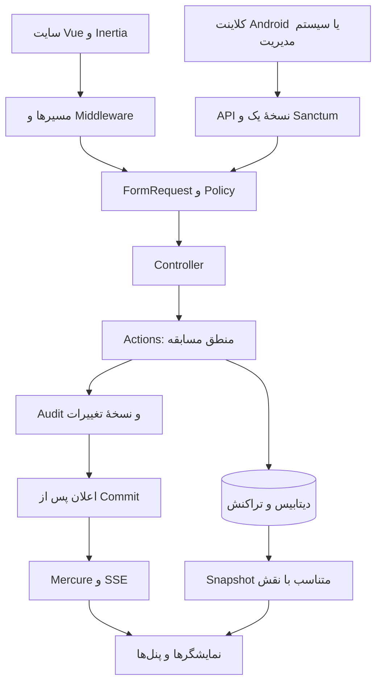
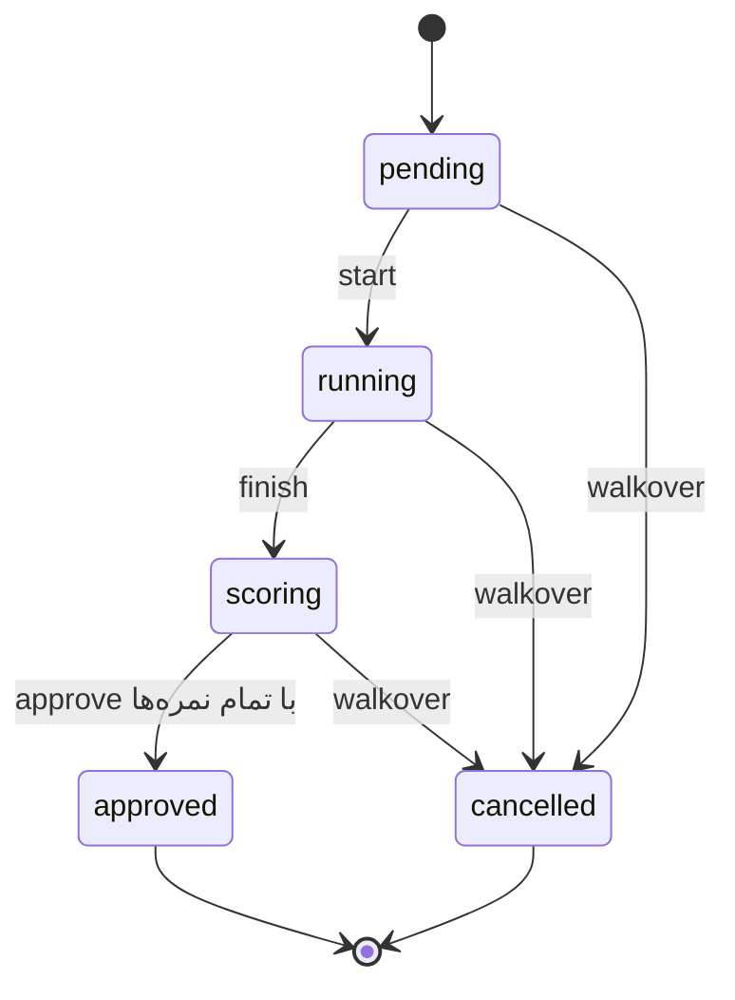

# سند فنی بک‌اند و گردش کار سامانهٔ مسابقات پومسه

**تاریخ بررسی:** ۲۰۲۶/۱۰/۰۵، منطقهٔ زمانی Asia/Tehran  
**شاخهٔ بررسی‌شده:** `backend`  
**نسخهٔ کد مبنا:** `afd1adc` ــ `feat: add main display and RTDS competition screens`  
**اصلاح بعد از نسخهٔ مبنا:** داوری ابداعی دقت ۶/اجرا ۴ و کنترل افزایش/کاهش نمره در ۲۰۲۶/۱۰/۰۵.

**مخاطب:** توسعه‌دهندهٔ بک‌اند، توسعه‌دهندهٔ Android، مسئول فنی و برگزارکننده

## ۱. هدف و مبنای این سند

این سند وضعیت واقعی کد را توضیح می‌دهد: معماری، داده‌ها، جریان سایت و مسابقه، داوری، قرعه، API، نمایشگرها و کارهای باقی‌مانده. «پیاده‌شده» یعنی مسیر اجرایی در کد وجود دارد؛ به معنی تضمین کارایی روی شبکهٔ سالن یا پذیرش نهایی توسط کارفرما نیست.

منابع بررسی:

- فایل‌های فعلی `app`، `routes`، `database`، `resources/js`، تنظیمات و آزمون‌های پروژه.
- «داکیومنت فنی سیستم پومسه»، نسخهٔ ۰٫۱: نقش‌ها، نیازمندی‌های مدیریت، بخش ۶ انواع مسابقه، بخش ۷ داوری، بخش ۸ قرعه و بخش ۹ نمایشگر/RTDS.
- «پروپوزال پومسه»: به‌ویژه ابداعی، زمان اجرا، گزارش‌گیری و تحویل عملیاتی.
- توضیحات کارفرما دربارهٔ Table چندمرحله‌ای، ترتیب اجرا، زمین‌ها، هشت فرم هر رده و تکرار فرم‌ها.
- تصمیم‌های تکمیلی کاربر: ابداعی انفرادی/زوجی با فایل موسیقی برای هر ورودی؛ اصلاح نمرهٔ ابداعی به دقت ۶ در سه مؤلفهٔ ۲ و اجرا ۴ با کسرهای ۰٫۱/۰٫۳؛ آماده‌سازی API ورود اطلاعات مدیریت؛ پیاده‌نکردن قرعه/ترتیب بر اساس رنکینگ.

**توجه به مستندات قدیمی:** [README](../README.md)، [قرارداد قدیمی بک‌اند](competition-backend-contract.md) و [راهنمای اتصال Android](android-realtime-integration.md) بخش‌هایی از نسخه‌های پیشین را توصیف می‌کنند. عبارت‌های «تیمی و ابداعی غیرفعال‌اند»، «هر جفت در دورهای با هم مسابقه می‌دهند»، «همیشه میانگین دو فرم» و نمونهٔ مستقیم نمرهٔ Android برای ردهٔ جدید، با کد فعلی یکسان نیستند. برای وضعیت این نسخه، توضیحات این سند و کد مبنا ملاک هستند.

### تعریف وضعیت‌ها

| وضعیت | معنی |
| --- | --- |
| پیاده‌شده | مسیر بک‌اند و در موارد مربوط، رابط سایت وجود دارد. |
| بخشی پیاده‌شده | زیرساخت موجود است، اما تمام سناریوی موردنیاز پوشش داده نشده است. |
| پیاده‌نشده | مسیر کاربردی برای قابلیت وجود ندارد؛ داشتن یک ستون دیتابیس کافی نیست. |
| خارج از محدودهٔ فعلی | با تصمیم کاربر/کارفرما کنار گذاشته شده یا فعلاً درخواست نشده است. |
| نیازمند تأیید عملیاتی | کد موجود است، ولی صحت روی دستگاه‌ها، شبکه یا بار واقعی هنوز اثبات نشده است. |

## ۲. خلاصهٔ وضعیت پروژه

هستهٔ یک مسابقه از ایجاد و ثبت‌نام تا قرعه، اجرای پومسه، دریافت نمرات، انتشار نتیجه، صعود در تک‌حذفی و پایان مسابقه پیاده شده است. انواع فعال عبارت‌اند از **استاندارد انفرادی، استاندارد تیمی سه‌نفره، ابداعی انفرادی و ابداعی زوجی**. هرکدام می‌توانند در قالب Table یا تک‌حذفی استفاده شوند.

| حوزه | وضعیت فعلی | محدودیت مهم |
| --- | --- | --- |
| ورود، نقش و دسترسی مسابقه | پیاده‌شده | ناظر فنی و فرایند اعتراض نقش/ماژول مستقل ندارند. |
| مسابقه، زمین، رده و اعضای برگزاری | پیاده‌شده | ویرایش عمومی مسابقه، مدیریت کامل اعضا و سطح مهارت کامل نیست. |
| شرکت‌کنندگان انفرادی، زوجی و تیمی | پیاده‌شده در انواع فعال | مربی، استان/شهر و شمارهٔ نمایشی شرکت‌کننده کامل نیست. |
| Table امتیازی | پیاده‌شده | حداکثر ۱۶ ورودی در مرحله؛ انتخاب خودکار نفرات برتر برای مرحلهٔ بعد ندارد. |
| تک‌حذفی سینگل/دوبل | پیاده‌شده | حداکثر ۶۴ ورودی؛ رنکینگ به درخواست کاربر پیاده نشده است. |
| مراحل و قرعهٔ هشت فرم | پیاده‌شده | قرعه فعلاً مشترک برای کل مرحله است؛ قرعهٔ جدا برای هر matchup ندارد. |
| داوری استاندارد ۴+۶ با ۵/۷ داور | پیاده‌شده | قواعد جدید مشخص‌اند؛ ویرایشگر دلخواه همهٔ قواعد وجود ندارد. |
| ابداعی با موسیقی و دقت ۶/اجرا ۴ | پیاده‌شده طبق اصلاح کاربر | نام و وزن معیارهای تخصصی ابداعی و کنترل زمان قانونی اجرا باقی مانده‌اند. |
| تساوی و بازگرداندن نمرات حذف‌شده | پیاده‌شده | تساوی نهایی Table رتبهٔ مشترک می‌دهد؛ تصمیم دستی Table ندارد. |
| API داور و دریافت اطلاعات مدیریت | پیاده‌شده | اپ Android و اتصال واقعی به سرویس مدیریت، جزو کد این مخزن نیستند. |
| نمایشگر اصلی و RTDS | پیاده‌شده | تأخیر کمتر از یک ثانیه در سالن اندازه‌گیری و تضمین نشده است. |
| ثبت سوابق و CSV | بخشی پیاده‌شده | گزارش تخصصی هر داور/رده، اعتراض و آرشیو مدیریتی کامل نیست. |
| پایداری و بازیابی | بخشی پیاده‌شده | پیش‌نویس و retry وجود دارد؛ آفلاین کامل، failover و آزمون بار باقی‌اند. |

## ۳. معماری فنی

### ۳.۱. فناوری‌های موجود

نسخه‌های بررسی‌شده از وابستگی‌های نصب‌شده:

| بخش | فناوری |
| --- | --- |
| محیط PHP پروژه | PHP 8.4؛ قید Composer برابر `^8.3` است. |
| چارچوب بک‌اند | Laravel 13.33.0 |
| رابط سایت | Inertia Laravel 3.3.4، Inertia Vue 3.7.1، Vue 3.5.43 |
| ساخت فرانت | Vite 8.3.0، Tailwind CSS 4.3.3 |
| احراز API | Laravel Sanctum 4.3.3 |
| ارتباط زنده | Laravel Broadcasting، Mercure/SSE، Echo با نسخهٔ Git مشخص در وابستگی |
| آزمون | PHPUnit 12.5.35 |
| دیتابیس | SQLite در توسعه/آزمون؛ تنظیمات و Compose برای MySQL موجود است. |
| صف و کش | تنظیمات دیتابیسی و Redis موجود است؛ Compose دارای MySQL 8.4 و Redis 7.4 است. |

### ۳.۲. مسیر درخواست



Controllerها درخواست و پاسخ را مدیریت می‌کنند. قواعد اصلی در `app/Actions` هستند و ثبت نمرهٔ وب و API هر دو از `SubmitScore` استفاده می‌کنند. درخواست معتبر در کلاینت به تنهایی مجوز تغییر داده نیست؛ Action پیش‌شرط‌های دامنه را دوباره کنترل می‌کند.

### ۳.۳. مسئولیت فایل‌های اصلی

| فایل | مسئولیت |
| --- | --- |
| [CreateTournament](../app/Actions/CreateTournament.php) | ساخت مسابقه، عضویت مدیر سازنده و Audit اولیه |
| [CompetitionSetup](../app/Actions/CompetitionSetup.php) | زمین، اعضا، رده، قواعد، ثبت‌نام و تأیید حضور |
| [ScheduleRound](../app/Actions/ScheduleRound.php) | ساخت مرحله، قرعهٔ نفرات، bye، پنل داوری و اجراها |
| [DrawRoundForms](../app/Actions/DrawRoundForms.php) | زمان قرعه و انتخاب دو فرم مجاز هر مرحله |
| [ImportManagementSnapshot](../app/Actions/ImportManagementSnapshot.php) | ورود نسخه‌دار اطلاعات سیستم مدیریت و قفل اطلاعات شروع‌شده |
| [RunCompetition](../app/Actions/RunCompetition.php) | شروع، پایان، تأیید، تعیین برنده، walkover و پایان مسابقه |
| [SubmitScore](../app/Actions/SubmitScore.php) | ثبت/اصلاح نمره، کنترل نسخه و جلوگیری از ثبت تکراری |
| [ConfirmProxyScore](../app/Actions/ConfirmProxyScore.php) | تأیید نمرهٔ جایگزین توسط مسئول دوم |
| [CalculateScore](../app/Actions/CalculateScore.php) | نمرهٔ تفصیلی، حذف نمرات پرت، میانگین و معیار رفع تساوی |
| [CompetitionView](../app/Actions/CompetitionView.php) | نمای مسابقه متناسب با نقش، مجموع و رتبه‌بندی |
| [CompetitionConsole](../app/Actions/CompetitionConsole.php) | اجرای فعال کورت، صف قابل شروع و وضعیت صندلی‌های داوری |
| [CompetitionDisplay](../app/Actions/CompetitionDisplay.php) | دادهٔ نمایشگر/RTDS، اجرای جاری، صف و revision |
| [TournamentPolicy](../app/Policies/TournamentPolicy.php) | دسترسی مشاهده، مدیریت و عملیات مسابقه |

## ۴. مدل داده

### ۴.۱. رابطهٔ موجودیت‌ها

```text
Tournament: یک رویداد مسابقه
  ├── Court: زمین‌ها
  ├── User + tournament_user: اعضا و نقش‌ها
  └── Category: یک رده با سبک، سن، جنسیت، قالب و قواعد
       ├── Entry: ورودی مسابقه، شامل یک/دو/سه Athlete
       ├── PoomsaeForm: فهرست فرم‌های مجاز رده
       ├── ScoringRuleSet: تعریف قواعد تأییدشده
       └── CompetitionRound: مرحله
            ├── Draw: سابقهٔ قرعهٔ فرم یا جدول
            └── Bout: رقابت دو ورودی یا اجرای تک‌ورودی Table
                 ├── JudgeAssignment: داور و شمارهٔ صندلی
                 └── Performance: اجرای یک فرم توسط یک ورودی
                      ├── ScoreSheet: نمرهٔ هر صندلی داوری
                      ├── score_components: دقت و اجرا
                      ├── score_revisions: سوابق اصلاح
                      └── Result: نتیجهٔ منتشرشده و snapshot محاسبه
```

تفاوت مهم: `Athlete` یک شخص است؛ `Entry` واحد شرکت در مسابقه است. یک تیم سه‌نفره یک Entry و سه Athlete دارد. سقف ۱۶/۶۴ برای تعداد **Entry** است، نه مجموع اعضای تیم‌ها.

### ۴.۲. جدول‌ها و اطلاعات کلیدی

| جدول | اطلاعات اصلی |
| --- | --- |
| `users` | حساب، رمز hash‌شده، وضعیت فعال و مدیر کل |
| `tournaments` | نام، محل، تاریخ‌ها، منطقهٔ زمانی، وضعیت و سازنده |
| `tournament_user` | نقش هر حساب در هر مسابقه؛ امکان چند نقش برای یک حساب |
| `courts` | زمین‌های متعلق به مسابقه |
| `categories` | سبک، نوع ورودی، سن، جنسیت، قالب، ترتیب اجرا، تعداد داور و برنامهٔ مراحل |
| `athletes` / `entries` / `entry_members` | اشخاص، واحد شرکت، اعضا، حضور و موسیقی |
| `competition_rounds` | ترتیب و نام مرحله، فرم‌های منتخب، زمان شروع، نسخهٔ جدول و snapshot خارجی |
| `bouts` / `bout_entries` | رقابت، زمین، ترتیب، سمت آبی/قرمز، برنده و دلیل تصمیم |
| `poomsae_forms` / `category_poomsae_form` | کاتالوگ فرم‌ها و فرم‌های مجاز هر رده |
| `draws` | الگوریتم، seed، نوع قرعه، ورودی و خروجی ثبت‌شده |
| `judge_assignments` | صندلی و داور هر رقابت |
| `performances` | فرم، ورودی، موسیقی، وضعیت، version و زمان‌های اجرا |
| `score_sheets` | revision، ثبت‌کننده، روش ثبت، breakdown و تأیید نمرهٔ جایگزین |
| `score_components` / `score_revisions` | مقادیر صحیح صدمی و تاریخچهٔ تغییر نمره |
| `results` | امتیاز با شش رقم اعشار، قواعد و جزئیات محاسبه، زمان انتشار |
| `idempotency_keys` | شناسهٔ درخواست، hash داده و پاسخ ثبت‌شده |
| `audit_logs` | عامل، اقدام، موضوع، قبل/بعد و زمان |

کلیدهای خارجی و uniqueها از مواردی مانند صندلی تکراری، ثبت نتیجهٔ دوم برای یک اجرا و اتصال Entry به ردهٔ ناسازگار جلوگیری می‌کنند. دادهٔ دارای سابقه در بسیاری از روابط با `restrictOnDelete` محافظت می‌شود.

**ستون داشتن با قابلیت داشتن فرق دارد:** `seed`، `federation_number`، وضعیت `disqualified`، زمان‌های مجاز اجرا و وضعیت `archived` در ساختار داده وجود دارند؛ مسیر اجرایی کامل همهٔ آن‌ها در فرم‌ها و Actionها موجود نیست.

## ۵. کاربران و جریان سایت

### ۵.۱. دسترسی‌ها

| نقش | کارهای مجاز اصلی |
| --- | --- |
| مدیر کل، `is_admin` | ایجاد مسابقه و عبور از بررسی نقش مسابقه؛ کنترل‌های تعلق و وضعیت همچنان اجرا می‌شوند. |
| مدیر مسابقه، `manager` | آماده‌سازی، ثبت‌نام، قرعه، واردکردن اطلاعات مدیریت، عملیات و پایان مسابقه |
| اپراتور، `operator` | اجرای مسابقه، مشاهدهٔ نمرات خام، نمرهٔ جایگزین، تعیین تکلیف و CSV |
| داور، `judge` | مشاهدهٔ پنل داوری و ارسال نمره فقط برای رقابت تخصیص‌یافته |
| نمایشگر، `display` | مشاهدهٔ امتیازها و RTDS؛ بدون اجازهٔ تغییر مسابقه |

کاربر غیرفعال حتی با session یا token قبلی مسدود می‌شود. مدیر کل یک flag روی User است؛ «ناظر فنی/اعتراض» نقش جداگانه‌ای ندارد.

### ۵.۲. صفحه‌ها

| صفحه | مسیر | رفتار |
| --- | --- | --- |
| ورود | `/login` | ورود با ایمیل و رمز؛ محدودیت تعداد تلاش |
| داشبورد | `/dashboard` | نمای شروع کاربر |
| فهرست مسابقات | `/tournaments` | مسابقات قابل مشاهده برای کاربر و ساخت مسابقه توسط مدیر کل |
| مرکز کنترل | `/tournaments/{id}` | مدیر/اپراتور: اجرای جاری و صف هر زمین |
| آماده‌سازی | `/tournaments/{id}/setup` | مدیر: زمین، اعضا، رده، ثبت‌نام، مراحل و میز اجرا |
| پنل داور | `/tournaments/{id}/judge` | اجراهای تخصیص‌یافته، ثبت و اصلاح نمره |
| نمایشگر اصلی | `/tournaments/{id}/scoreboard` | نام‌ها، فرم‌ها، امتیاز، نتیجه و جدول مرحله‌ها |
| RTDS | `/tournaments/{id}/rtds` | اجرای جاری و اجراهای بعدی هر کورت |
| خروجی | `/tournaments/{id}/results.csv` | نمرات منتشرشده با دسترسی اپراتور/مدیر |

بازکردن مسیر مسابقه برای داور به پنل داور و برای حساب نمایشگر به نمایشگر اصلی هدایت می‌شود. رابط فارسی است و پنل داوری در مرورگر تبلت نیز قابل استفاده است؛ این قابلیت به معنی وجود اپ native Android نیست.

### ۵.۳. احراز هویت

- وب: session، محافظت CSRF، تعویض شناسهٔ session هنگام ورود و invalidate هنگام خروج.
- API: توکن Bearer از Sanctum با اعتبار ۱۲ ساعت؛ لغو توکن فعلی از مسیر DELETE.
- abilityهای پایه: `tournaments:read` و `scores:write`؛ برای مدیر واجد شرایط `competition:manage` نیز اضافه می‌شود.
- ability به تنهایی کافی نیست؛ نقش مسابقه، تخصیص صندلی و تعلق منبع دوباره بررسی می‌شوند.
- ورود: حداکثر ۵ تلاش در دقیقه برای ترکیب ایمیل/IP و ۳۰ تلاش در دقیقه برای IP؛ API احرازشده: ۱۲۰ درخواست در دقیقه به ازای کاربر.

## ۶. آماده‌سازی و ثبت شرکت‌کننده

### ۶.۱. مراحل آماده‌سازی

1. مدیر کل مسابقه را با نام، تاریخ، محل و منطقهٔ زمانی می‌سازد؛ سازنده مدیر آن مسابقه می‌شود.
2. مدیر زمین‌ها و حساب‌های داور، اپراتور و نمایشگر را اضافه می‌کند.
3. مدیر رده را با سبک، نوع شرکت، سن، جنسیت، مدل برگزاری و تعداد داور می‌سازد.
4. قواعد محاسبه، تعداد مراحل و نام مراحل مشخص می‌شوند؛ قواعد باید تأیید شوند.
5. شرکت‌کنندگان ثبت و وضعیت حضور همهٔ آن‌ها تعیین می‌شود.
6. برای مرحله، زمین و پنل ۵ یا ۷ داور فعال انتخاب و جدول ساخته می‌شود.
7. قرعهٔ فرم‌ها در زمان مجاز انجام می‌شود؛ اجرای استاندارد بدون فرم منتخب شروع نمی‌شود.

### ۶.۲. انواع فعال

| سبک | نوع شرکت | تعداد اعضای Entry | اجرا در هر مرحله | نمرهٔ هر داور |
| --- | --- | --- | --- | --- |
| استاندارد، `recognized` | `individual` | ۱ | دو پومسه | دقت از ۴ + اجرا از ۶ |
| استاندارد، `recognized` | `team` | ۳ | دو پومسه برای تیم | یک نمره برای اجرای تیم |
| ابداعی، `freestyle` | `individual` | ۱ | یک اجرا با موسیقی | دقت از ۶ + اجرا از ۴ |
| ابداعی، `freestyle` | `pair` | ۲ | یک اجرا با موسیقی مشترک | دقت از ۶ + اجرا از ۴ برای اجرای زوج |

استاندارد زوجی و ابداعی تیمی در مسیر فعلی ایجاد رده مجاز نیستند. ابداعی تیمی سه/پنج‌نفره طبق توضیح کارفرما فعلاً از محدوده کنار گذاشته شده است.

### ۶.۳. اعتبارسنجی ثبت‌نام

- سن هر عضو بر اساس تولد واقعی در تاریخ شروع مسابقه محاسبه می‌شود.
- محدودهٔ سن، جنسیت رده و تعداد اعضا کنترل می‌شوند.
- در ردهٔ مختلط باید هر دو جنسیت در اعضا وجود داشته باشد.
- تکرار یک شخص با نام، نام خانوادگی و تاریخ تولد یکسان در همان رده رد می‌شود.
- نام، تاریخ تولد، جنسیت و باشگاه ثبت می‌شوند؛ زوج/تیم از نام اعضا عنوان نمایشی می‌گیرد.
- وضعیت اولیه `registered` است؛ فقط `checked_in`ها وارد جدول می‌شوند.
- تا وقتی وضعیت بعضی ورودی‌ها `registered` باشد، قرعهٔ جدول ساخته نمی‌شود.
- بعد از ساخت جدول، تغییر محلی فهرست/حضور رده قفل می‌شود؛ ردهٔ خارجی نیز تحت کنترل سیستم مدیریت است.
- ویرایش تنظیمات ردهٔ محلی فقط پیش از جدول، بدون ورزشکار و پیش از قرعهٔ فرم مجاز است.

قالب‌های آمادهٔ رده‌های سنی و فهرست رسمی هشت فرم برای هر سن به‌صورت کاتالوگ از پیش تکمیل‌شده وجود ندارند؛ مدیر نام‌ها را وارد می‌کند یا از سیستم مدیریت دریافت می‌شوند.

### ۶.۴. موسیقی ابداعی

فایل `mp3`، `wav` یا `m4a` با حداکثر ۲۰ مگابایت در ثبت‌نام الزامی است. فایل روی disk محلی ذخیره و مسیر آن هنگام ساخت اجرا در Performance ثبت می‌شود. فقط مدیر/اپراتور مجاز به دریافت فایل از مسیر محافظت‌شدهٔ موسیقی هستند و در میز اجرا کنترل پخش صوت وجود دارد.

پخش موسیقی با دکمهٔ شروع/پایان اجرا همگام‌سازی خودکار ندارد. ویرایش/تعویض فایل پس از ثبت‌نام و بارگذاری مستقیم آن با API عمومی کامل نشده است. تنظیم سقف upload در PHP و وب‌سرور نیز باید با سقف برنامه سازگار باشد؛ حد ۲۰ مگابایت در validation به تنهایی تنظیم PHP را تغییر نمی‌دهد.

## ۷. جریان مسابقات و مراحل

### ۷.۱. وضعیت‌ها



این نمودار متعلق به Performance است. وضعیت مرحله `pending → running → completed` و وضعیت مسابقه `draft → ready → running → completed` است. `archived` در دیتابیس مسابقه وجود دارد، ولی مسیر کامل آرشیو در سایت پیاده نشده است.

| فرمان | پیش‌شرط و اثر |
| --- | --- |
| `start` | pending؛ فرم/موسیقی معتبر، پایان مرحلهٔ قبل، پنل فعال و زمین آزاد؛ زمان شروع و version جدید ثبت می‌شوند. |
| `finish` | running؛ زمان پایان ثبت و اجازهٔ ثبت نمره باز می‌شود. |
| `approve` | scoring؛ دقیقاً تمام صندلی‌های پنل باید نمرهٔ submitted داشته باشند؛ Result منتشر و اجرا قفل می‌شود. |

شروع و پایان خودکار بر اساس زمان اجرا وجود ندارد؛ اپراتور فرمان می‌دهد. در یک زمین نمی‌توان اجرای running/scoring دیگری شروع کرد و یک داور نمی‌تواند همزمان روی دو زمین، حتی در دو مسابقه، داوری کند.

### ۷.۲. برنامهٔ مراحل

- `planned_round_count` بین ۱ تا ۶ است؛ ترتیب و نام مرحله‌ها هنگام ساخت رده ذخیره می‌شوند.
- ردهٔ استاندارد مرحله‌دار هشت فرم مجاز دارد؛ دو فرم منتخب روی خود مرحله ذخیره می‌شوند.
- رده‌های قدیمی بدون برنامهٔ مراحل می‌توانند با دو فرم ثابت قبلی کار کنند.
- ساخت جدول مرحلهٔ بعد و شروع آن به پایان مرحلهٔ قبلی وابسته است.
- ساخت مرحلهٔ بعد در مسیر محلی با اقدام مدیر انجام می‌شود؛ صرف پایان مرحله، جدول بعد را خودکار نمی‌سازد.
- برای تک‌حذفی، تعداد مراحل برنامه‌ریزی‌شده باید برابر `ceil(log2(تعداد ورودی‌های حاضر))` باشد.
- پایان کل مسابقه فقط وقتی مجاز است که همهٔ رده‌ها و تمام مراحل برنامه‌ریزی‌شده تمام شده و تک‌حذفی‌ها به فینال تکمیل‌شده رسیده باشند.

### ۷.۳. Table امتیازی، `round_robin`

نام داخلی قالب `round_robin` است، اما مدل فعلی **جدول امتیازی تک‌ورودی** است: هر Entry در مرحله یک Bout مستقل دارد و با سایر ورودی‌ها مسابقهٔ رودررو نمی‌دهد.

- استاندارد: دو پومسه و رتبه‌بندی بر اساس مجموع نتیجهٔ دو فرم.
- ابداعی: یک اجرای موسیقی‌دار و رتبه‌بندی بر اساس همان نتیجه.
- حداکثر ورودی‌های حاضر در مرحله: ۱۶.
- `consecutive`: هر ورودی فرم اول و دوم را کامل می‌کند، سپس ورودی بعدی.
- `phased`: همهٔ ورودی‌ها فرم اول را کامل می‌کنند، سپس فرم دوم از ابتدای ترتیب اجرا.
- نتیجهٔ فرم قبلی باید تأیید شود تا اجرای بعدی طبق ترتیب مجاز شود.
- در Table چندمرحله‌ای محلی، همهٔ شرکت‌کنندگان مرحلهٔ قبل به مرحلهٔ بعد منتقل می‌شوند؛ انتخاب خودکار «نصف برتر» یا «هشت نفر فینال» وجود ندارد.
- رتبهٔ نمایشی از آخرین مرحله‌ای است که جدول آن ساخته شده است؛ جمع تجمعی امتیاز تمام مراحل یا تمام هفته‌های لیگ محاسبه نمی‌شود.
- تساوی امتیاز با میانگین نمرات بازگردانده‌شده مقایسه می‌شود؛ تساوی دوباره رتبهٔ مشترک دارد.

در ورودی خارجی، فرستنده می‌تواند شرکت‌کنندگان مرحله را از طریق `bouts` تعیین کند؛ این با داشتن موتور محلیِ انتخاب خودکار نفرات صعودکننده یکسان نیست.

### ۷.۴. تک‌حذفی، `knockout`

- جدول دور اول با seed تصادفی و مرتب‌سازی hash ساخته می‌شود؛ حداکثر ۶۴ Entry حاضر.
- اگر تعداد نفرات توان دو نباشد، اندازهٔ جدول به توان دو بعدی می‌رود و bye داده می‌شود.
- bye برندهٔ قطعی دارد و Performance ساختگی برایش ایجاد نمی‌شود.
- استاندارد: هر طرف دو پومسه؛ برنده با مجموع امتیاز دو فرم تعیین می‌شود.
- ابداعی: هر طرف یک اجرا؛ برنده با امتیاز همان اجرا تعیین می‌شود.
- دور بعد از برندگان قطعی دور قبل به همان ترتیب جدول ساخته می‌شود؛ دوباره قرعهٔ تصادفی انجام نمی‌شود.
- جدول واردشده برای مراحل بعد، هنگام شروع باید دقیقاً با برندگان مرحلهٔ قبل تطابق داشته باشد.

**سینگل، `alternating`:** آبی فرم ۱، قرمز فرم ۱، آبی فرم ۲، قرمز فرم ۲. برای ابداعی فقط اجراهای فرم ۱ وجود دارند.

**دوبل، `simultaneous`:** دو طرف فرم یکسان را همزمان شروع و تمام می‌کنند. نمرهٔ هر طرف جدا ثبت و تأیید می‌شود. سپس گروه فرم بعدی قابل اجرا می‌شود. «دوبل» در این پروژه یعنی اجرای همزمان؛ به معنی جدول دوحذفی نیست.

زمان استراحت بین دو فرم، شمارش معکوس و قفل الزام‌آور ۳۰ ثانیه‌ای پیاده نشده‌اند؛ فاصله را اپراتور مدیریت می‌کند. نوع اجرای سینگل/دوبل فعلاً تنظیم رده است و انتخاب مستقل آن برای هر مرحله وجود ندارد.

## ۸. قرعهٔ نفرات و قرعهٔ فرم‌ها

دو قرعه مستقل‌اند: قرعهٔ جدول شرکت‌کنندگان و انتخاب پومسه‌های مرحله.

### ۸.۱. قرعهٔ جدول

`ScheduleRound` فهرست حاضرها را با seed تصادفی ۱۶بایتی و `sha256_seed_sort_v1` مرتب می‌کند. اطلاعات ورودی، پنل و جفت‌ها در `draws` ذخیره می‌شوند. الگوریتم دورهای بعدی `advance_in_order_v1` است.

**رنکینگ/Seeding عملیاتی پیاده نشده است و به درخواست صریح کاربر از محدوده کنار گذاشته شده است.** وجود ستون `seed` به معنی استفاده از آن در قرعه نیست.

### ۸.۲. زمان قرعهٔ فرم

تنظیمات رده عبارت‌اند از `form_draw_timing`، `form_draw_time`، `planned_round_count` و `allow_form_repetition`.

| گزینه | رفتار فعلی |
| --- | --- |
| `day_before` | روز قبل از تاریخ شروع، در ساعت تعیین‌شده و منطقهٔ زمانی مسابقه؛ انتخاب فرم‌های مراحل تعیین‌نشده |
| `morning` | روز شروع، در ساعت تعیین‌شده؛ انتخاب فرم‌های مراحل تعیین‌نشده |
| `before_stage` | قرعهٔ مرحلهٔ منتخب با اقدام مدیر؛ از تاریخ شروع و برای مراحل بعد، پس از تکمیل مرحلهٔ قبل |

فرمان [DrawDueForms](../app/Console/Commands/DrawDueForms.php) با نام `poomsae:draw-forms` از Scheduler هر دقیقه اجرا می‌شود. این خودکارسازی مربوط به `day_before` و `morning` و رده‌های محلی است. `before_stage` در این فرمان خودکار نمی‌شود.

### ۸.۳. تکرار و عدم تکرار

- در هر مرحله، دو فرم همیشه متفاوت‌اند؛ حتی در حالت تکراری، `[F1,F1]` مجاز نیست.
- تکراری: فرم مرحلهٔ قبل می‌تواند در مرحلهٔ بعد دوباره انتخاب شود.
- غیرتکراری: فرم‌های تمام مراحل دیگر **همان رده** از pool حذف می‌شوند.
- هشت فرم و دو فرم در هر مرحله یعنی حداکثر چهار مرحلهٔ غیرتکراری. برای پنج/شش مرحله، درخواست رد می‌شود و pool خودکار از نو پر نمی‌شود.
- فرم یک رده می‌تواند در ردهٔ دیگر استفاده شود؛ عدم تکرار، سراسری بین رده‌ها نیست.
- قرعه روی مرحله ذخیره می‌شود و همهٔ شرکت‌کنندگان همان مرحله فرم‌های یکسان می‌گیرند.
- پس از شروع مرحله یا اجرا، تغییر فرم‌ها مجاز نیست.
- در ابداعی قرعهٔ فرم استاندارد وجود ندارد.

مثال با pool هشت‌تایی:

| مرحله | غیرتکراری | تکراری |
| --- | --- | --- |
| ۱ | F1 و F2 | F1 و F2 |
| ۲ | F3 و F4 | F1 و F5 |
| ۳ | F5 و F6 | F2 و F5 |
| ۴ | F7 و F8 | F1 و F3 |

حالت قرعهٔ مستقل «قبل از ورود هر شرکت‌کننده/هر matchup» در بخش ۸٫۳ سند اولیه و توضیحات تک‌حذفی کارفرما هنوز پیاده نشده است. `before_stage` جایگزین همان رفتار نیست.

## ۹. داوری، محاسبه و انتشار

### ۹.۱. استاندارد

رده‌های جدید از روش `deductions_and_components_v1` استفاده می‌کنند:

```text
Accuracy = 4.00 - sum(accuracy_penalties)
Presentation = P1 + P2 + P3
0 <= Pi <= 2.00
```

کسرهای دقت `0.10` و `0.30` هستند. مجموع کسر بیش از ۴، مؤلفهٔ اجرا بیش از ۲ و اختلاف مجموع اعلام‌شده با breakdown رد می‌شوند. API علاوه بر دو مقدار نهایی، آرایهٔ کسرها و سه مؤلفه را برای قواعد جدید الزامی می‌کند. فرم وب ابتدا دقت و سپس بخش اجرا را باز می‌کند. دکمه‌های افزایش/کاهش `0.10` و `0.30` در هر بخش موجودند؛ افزایش دقت با برگرداندن کسر انجام می‌شود و سقف ۴ حفظ می‌شود. مؤلفه‌های اجرا نیز بین صفر و ۲ باقی می‌مانند.

### ۹.۲. پردازش پنل

| پنل | گزینهٔ حذف | تعداد باقی‌مانده در هر مؤلفه |
| --- | --- | --- |
| ۵ داور | یک کمینه و یک بیشینه | ۳ |
| ۷ داور، حالت A | یک کمینه و یک بیشینه | ۵ |
| ۷ داور، حالت B | دو کمینه و دو بیشینه | ۳ |

حذف در دقت و اجرا **مستقل** است؛ لزوماً یک داور مشخص از هر دو مؤلفه حذف نمی‌شود. نمرات خام پاک نمی‌شوند و مقدارهای مرتب‌شده/باقی‌مانده در snapshot محاسبه حفظ می‌شوند.

محاسبه با اعداد صحیح صدمی و مقیاس میلیونیم انجام می‌شود؛ نتیجه به صورت رشتهٔ اعشاری با شش رقم ذخیره می‌شود. الگوریتم نهایی هر فرم `component_trimmed_mean_v1` است.

**ردهٔ استاندارد جدید:** میانگین فیلترشدهٔ دقت + میانگین فیلترشدهٔ اجرا = نمرهٔ فرم از ۱۰؛ جمع دو فرم = امتیاز مرحله از ۲۰. ردهٔ قدیمی ممکن است `mean_two_forms` داشته باشد؛ همان قاعدهٔ ذخیره‌شده اجرا می‌شود.

### ۹.۳. ابداعی

طبق اصلاح درخواست کاربر، رده‌های جدید ابداعی از `components_and_deductions_v1` استفاده می‌کنند:

```text
Accuracy = A1 + A2 + A3
0 <= Ai <= 2.00
Presentation = 4.00 - sum(presentation_penalties)
```

دقت از ۶ و اجرا از ۴ است. کسرهای اجرا فقط `0.10` و `0.30` هستند. فرم وب برای هر مؤلفه و بخش کسرها دکمه‌های افزایش/کاهش همین مقدارها دارد؛ افزایش اجرا کسر قبلی را برمی‌گرداند و از ۴ بالاتر نمی‌رود. API دو نمرهٔ نهایی، سه مؤلفهٔ دقت و آرایهٔ کسرهای اجرا را تطبیق می‌دهد. حذف نمرات پرت در دو بخش مستقل است و جمع دو میانگین، امتیاز یک اجرا از ۱۰ را می‌سازد؛ تجمیع `single_performance` حفظ شده است.

Migration `2026_10_05_120037_upgrade_unstarted_freestyle_scoring_rules` ردهٔ ابداعی قدیمیِ شروع‌نشده و بدون نمره/نتیجه را به نسخهٔ جدید منتقل می‌کند، نسخهٔ اجرای در انتظار را افزایش می‌دهد و audit ثبت می‌کند. رده‌های شروع‌شده یا پایان‌یافته قانون قبلی `single_score_v1` را نگه می‌دارند؛ برای آن‌ها Android همچنان فقط `score` از ۱۰ می‌فرستد. نمرات کل قبلی به مؤلفه‌های حدسی تبدیل نمی‌شوند.

نام و وزن معیارهای تخصصی ابداعیِ پروپوزال هنوز تنظیم نشده‌اند؛ سه مؤلفهٔ جدید با شمارهٔ ۱ تا ۳ نمایش داده می‌شوند.

### ۹.۴. رفع تساوی

1. ابتدا امتیاز رسمی مقایسه می‌شود.
2. در تساوی، همهٔ نمرات حذف‌شدهٔ هر مؤلفه برگردانده می‌شوند و میانگین با کل پنل محاسبه می‌شود.
3. معیار مرحله با همان aggregation رده ساخته می‌شود: جمع دو فرم برای استاندارد جدید، یک اجرا برای ابداعی یا میانگین دو فرم برای قاعدهٔ قدیمی.
4. اگر معیار جدید متفاوت باشد، برنده/رتبه با آن تعیین می‌شود؛ امتیاز منتشرشدهٔ اصلی بازنویسی نمی‌شود.
5. تساوی دوباره در تک‌حذفی نیازمند انتخاب برنده با دلیل توسط مسئول مجاز است. در Table، رتبهٔ مشترک حفظ می‌شود.

ثبت دستی برندهٔ تساوی وقتی معیار بازگرداندن نمرات برنده را مشخص می‌کند، مجاز نیست.

### ۹.۵. اصلاح و نمرهٔ جایگزین

- هر صندلی برای هر Performance یک ScoreSheet دارد.
- اصلاح قبل از تأیید نهایی، با `expected_revision` و دلیل حداقل پنج کاراکتری انجام می‌شود.
- بعد از انتشار Result، نمره قابل اصلاح در مسیر عادی نیست.
- مدیر/اپراتور برای صندلی بدون نمره می‌تواند نمرهٔ جایگزین با دلیل حداقل ده کاراکتری ثبت کند.
- نمرهٔ جایگزین ابتدا `draft` است و در شمار نمرات نهایی پنل/preview وارد نمی‌شود.
- تأیید آن باید توسط مدیر/اپراتور دیگری انجام شود؛ ثبت‌کننده نمی‌تواند همان نمره را تأیید کند.
- داور می‌تواند نمرهٔ جایگزین تأییدنشده را با revision و سابقهٔ روشن جایگزین کند؛ پس از تأیید آن این بازنویسی مجاز نیست.
- نام عامل، زمان، revision، breakdown و دلیل اصلاح در سوابق نگهداری می‌شوند.

## ۱۰. انصراف، عدم حضور و بستن مسابقه

### پیش از قرعه

وضعیت Entry به `withdrawn` تغییر می‌کند و در جدول حاضرها قرار نمی‌گیرد. بعد از ساخت جدول، مسیر عادی تغییر حضور مسدود است.

### بعد از قرعهٔ تک‌حذفی

اپراتور/مدیر در رقابت دوطرفه از `decision_type=walkover` استفاده می‌کند؛ برنده باید یکی از همان دو Entry باشد، دلیل لازم است و `confirmed=true` لغو اجراهای باقی‌مانده را تأیید می‌کند.

- اجراهای تأییدنشدهٔ همان رقابت `cancelled` و version آن‌ها افزایش می‌یابد.
- Resultهای قبلاً منتشرشده حفظ می‌شوند.
- Bout با برنده تمام می‌شود و در صورت پایان همهٔ رقابت‌ها، مرحله تمام می‌شود.
- برنده در ساخت مرحلهٔ بعد صعود می‌کند.
- این عملیات به تنهایی وضعیت عمومی Entry را برای همهٔ رویدادها تغییر نمی‌دهد.

**محدودیت:** Table فعلی تک‌ورودی است و `resolve` فقط Bout دوطرفه را می‌پذیرد؛ مسیر عملیاتی مشخص برای انصراف یک ورودی Table بعد از جدول، لغو اجراهایش و اصلاح رتبه‌بندی هنوز وجود ندارد.

مسابقهٔ completed را نمی‌توان از مسیرهای عادی دوباره اجرا یا آماده‌سازی کرد. فرایند بازگشایی، اعتراض و اصلاح رسمی نتیجهٔ منتشرشده پیاده نشده است.

## ۱۱. ارتباط با سیستم مدیریت مسابقات

### ۱۱.۱. قابلیت موجود

مسیر زیر آماده است:

```http
PUT /api/v1/tournaments/{tournament}/categories/{category}/management-snapshot
Authorization: Bearer {token}
Content-Type: application/json
```

این مسیر **ورودی داده** است: سامانهٔ مدیریت اطلاعات را می‌فرستد. کد فعلی به API خارجی وصل نمی‌شود و مستقیم دیتابیس سامانهٔ دیگر را نمی‌خواند.

| بخش ورودی | مفهوم |
| --- | --- |
| `source` | شناسهٔ سیستم فرستنده |
| `version` / `expected_version` | نسخهٔ جدید و نسخهٔ فعلی مورد انتظار |
| `draw_method` | فعلاً فقط `random` |
| `category` | اطلاعات قابل ورود رده مانند نام، محدودهٔ سن و هشت فرم |
| `entries` | شناسهٔ خارجی، حضور، اعضا و در صورت نیاز `local_entry_id` |
| `stages` | شماره/نام مرحله، دو فرم یا فرم خالی، زمین، داورها و ترتیب ورودی‌های Bout |
| `reason` | دلیل اصلاح برای نسخه‌های بعدی |

ردهٔ دارای برنامهٔ مراحل و قواعد تأییدشده باید از قبل وجود داشته باشد. زمین‌ها و داورها باید از همان مسابقه باشند؛ شناسه‌های خارجی ورودی‌ها به شناسه‌های محلی نگاشت می‌شوند.

### ۱۱.۲. نسخه‌بندی و نگهداری محلی

- snapshot، hash، source و نسخه روی رده و مرحله ذخیره می‌شوند.
- ارسال دوبارهٔ همان نسخه و محتوای یکسان `replayed=true` می‌دهد.
- نسخهٔ یکسان با محتوای متفاوت، نسخهٔ قدیمی یا expected_version ناسازگار با `409` رد می‌شود.
- پس از شروع، اعضا و اطلاعات قفل‌شده قابل تعویض نیستند.
- مرحلهٔ شروع‌شده با جدول/فرم جدید جایگزین نمی‌شود؛ مراحل شروع‌نشده تحت شرایط اعتبارسنجی قابل اصلاح‌اند.
- تغییرات با Audit ثبت و عملیات در تراکنش انجام می‌شود.
- ردهٔ متصل به سیستم مدیریت از مسیر قرعه و ثبت‌نام محلی تغییر داده نمی‌شود.
- برای ابداعی، موسیقی باید قبلاً در ثبت‌نام محلی بارگذاری شده باشد و `local_entry_id` برای اتصال ارسال شود.

اگر ارتباط با **سامانهٔ مدیریت** قطع شود ولی سرور پومسه و شبکهٔ داورها فعال باشند، اجرای مرحلهٔ دریافت‌شده با دادهٔ محلی ادامه می‌یابد. قطع ارتباط داورها با خود سرور پومسه موضوع دیگری است و ثبت آفلاین خودکار را فعال نمی‌کند.

### ۱۱.۳. باقی‌ماندهٔ اتصال

قرارداد و نمونهٔ واقعی سرویس خارجی، نگاشت کامل شناسه‌های زمین/داور، برنامهٔ ارسال، دریافت خودکار نسخهٔ تازه پیش از شروع، ارسال نتایج به مدیریت و آزمون سرتاسری با آن سیستم هنوز آمادهٔ تحویل عملیاتی نشده‌اند.

## ۱۲. قرارداد مسیرهای وب و API

### ۱۲.۱. مسیرهای عملیاتی وب

همهٔ مسیرهای این جدول پیشوند `/tournaments/{tournament}` دارند و از session، CSRF و بررسی دسترسی استفاده می‌کنند:

| روش و پسوند | عملیات | نقش اصلی |
| --- | --- | --- |
| `POST /courts` | افزودن زمین | مدیر |
| `POST /members` | افزودن داور/اپراتور/نمایشگر | مدیر |
| `POST /categories` | ساخت رده | مدیر |
| `PUT /categories/{category}` | ویرایش ردهٔ مجاز | مدیر |
| `POST /categories/{category}/entries` | ثبت ورودی و موسیقی | مدیر |
| `PATCH /entries/{entry}/status` | حضور/انصراف پیش از جدول | مدیر |
| `POST /categories/{category}/rounds` | ساخت جدول مرحله | مدیر |
| `POST /categories/{category}/forms/draw` | قرعهٔ فرم‌های مرحله | مدیر |
| `POST /performances/{performance}/command` | start/finish/approve | مدیر/اپراتور |
| `POST /performances/{performance}/scores` | ثبت/اصلاح نمره | داور تخصیص‌یافته |
| `POST /performances/{performance}/proxy-scores` | ثبت نمرهٔ جایگزین | مدیر/اپراتور |
| `POST /performances/{performance}/proxy-scores/{scoreSheet}/confirm` | تأیید نمرهٔ جایگزین | مسئول مجاز دوم |
| `POST /bouts/{bout}/resolve` | تساوی یا walkover | مدیر/اپراتور |
| `POST /complete` | پایان مسابقه | مدیر |
| `GET /performances/{performance}/music` | فایل موسیقی محافظت‌شده | مدیر/اپراتور |
| `GET /display-data?revision={revision}` | تغییرات نمایشگر | عضو مجاز مسابقه |

مسیرهای صفحه‌ها و CSV در بخش ۵ آمده‌اند. mutation وب معمولاً redirect همراه flash یا خطای validation می‌دهد. **کد HTTP 302 به تنهایی خطای برنامه نیست**؛ در جریان فرم Inertia می‌تواند نتیجهٔ موفق یا برگشت همراه خطای validation باشد. جزئیات خطای فرم و پاسخ صفحهٔ بعد باید بررسی شود.

### ۱۲.۲. API نسخهٔ یک

| روش و مسیر | کاربرد |
| --- | --- |
| `POST /api/v1/auth/token` | ورود و ساخت توکن |
| `DELETE /api/v1/auth/token` | لغو توکن فعلی |
| `GET /api/v1/me` | مشخصات حساب فعلی |
| `GET /api/v1/tournaments` | مسابقات قابل دسترسی |
| `GET /api/v1/tournaments/{tournament}` | اطلاعات مسابقه |
| `GET /api/v1/tournaments/{tournament}/competition` | snapshot متناسب با نقش و اطلاعات realtime |
| `POST /api/v1/tournaments/{tournament}/categories` | ساخت رده با ability مدیریت و Policy |
| `POST /api/v1/tournaments/{tournament}/performances/{performance}/scores` | ثبت/اصلاح نمرهٔ داور |
| `PUT /api/v1/tournaments/{tournament}/categories/{category}/management-snapshot` | دریافت برنامهٔ مدیریت |
| `POST /api/v1/broadcasting/auth` | احراز کانال‌های Mercure |

API فعلی مدیریت کامل وب را تکرار نمی‌کند: مسیر JSON مستقل برای تمام عملیات start/finish/approve، ثبت موسیقی، عضویت و تصمیم‌های اپراتور وجود ندارد.

### ۱۲.۳. نمونهٔ Android برای استاندارد جدید

شناسه‌ها، version و revision باید از snapshot جاری گرفته شوند. UUID زیر نمونه است:

```json
{
  "request_id": "b3e10f3b-201c-48b9-8f3f-d50ae4525e74",
  "expected_version": 3,
  "expected_revision": 0,
  "accuracy": "3.60",
  "presentation": "5.40",
  "accuracy_penalties": ["0.10", "0.30"],
  "presentation_components": ["1.80", "1.90", "1.70"]
}
```

دقت `4 - 0.1 - 0.3 = 3.6` و اجرا `1.8 + 1.9 + 1.7 = 5.4` است. مقدار نهایی اعلام‌شده باید با آرایه‌ها برابر باشد. برای اصلاح، revision جدید، UUID جدید و `reason` لازم است. برای retry همان تلاش، **همان UUID و همان payload** ارسال می‌شود.

ردهٔ قدیمی که input_method تفصیلی ندارد ممکن است فقط accuracy/presentation بپذیرد. کلاینت باید قواعد snapshot را بخواند؛ نمونهٔ قدیمی راهنمای Android برای تمام رده‌های جدید کافی نیست.

### ۱۲.۴. نمونهٔ ابداعی

```json
{
  "request_id": "f90fc09c-0151-4874-8394-f99a0eb790e7",
  "expected_version": 3,
  "expected_revision": 0,
  "accuracy": "5.50",
  "presentation": "3.60",
  "accuracy_components": ["2.00", "1.75", "1.75"],
  "presentation_penalties": ["0.30", "0.10"]
}
```

این نمونه مخصوص قاعدهٔ جدید `components_and_deductions_v1` است: `5.50 + 3.60 = 9.10`. آرایهٔ بدون کسر باید `[]` باشد و `score` و آرایه‌های استاندارد ارسال نمی‌شوند. کلاینت باید `rules.input_method` را بخواند؛ ردهٔ قدیمی `single_score_v1` فقط `score` می‌پذیرد.

### ۱۲.۵. پاسخ و خطا

پاسخ ثبت نمره شامل `score_sheet_id`، `revision` و `requires_confirmation` است. در مسیر عادی داور، نمره submitted است؛ نمرهٔ جایگزین به تأیید نیاز دارد.

| کد | معنی |
| --- | --- |
| ۲۰۰ | دریافت/ثبت موفق طبق قرارداد مسیر |
| ۲۰۱ | ساخت توکن یا رده |
| ۲۰۴ | لغو موفق توکن |
| ۴۰۱ | احراز هویت نامعتبر یا منقضی |
| ۴۰۳ | نقش، ability یا تخصیص صندلی نامعتبر |
| ۴۰۴ | منبع ناموجود یا ناسازگار با مسابقه |
| ۴۰۹ | تعارض version/revision یا UUID با payload متفاوت |
| ۴۲۲ | validation یا نقض قاعدهٔ دامنه |
| ۴۲۹ | عبور از محدودیت درخواست |

در وب Inertia، تعارض ۴۰۹ به خطای قابل خواندن فرم برگردانده می‌شود. رفتار JSON API با redirect فرم وب یکسان نیست.

## ۱۳. نمایشگر اصلی، RTDS و Mercure

### ۱۳.۱. نمایشگر اصلی

[Scoreboard.vue](../resources/js/Pages/Competition/Scoreboard.vue) و [DisplayBout.vue](../resources/js/Components/DisplayBout.vue) نمایش می‌دهند:

- نام مسابقه، رده، مرحله و کورت؛ نام شخص/زوج/تیم.
- سمت و رنگ آبی/قرمز در تک‌حذفی.
- فرم‌های منتخب، وضعیت هر اجرا، تعداد نمره‌های دریافت‌شده و زمان سپری‌شدهٔ اجرای جاری.
- نمرهٔ هر فرم، مجموع یا aggregation رده، برنده/قهرمان و رتبهٔ Table.
- اجراهای فعال، نتایج اخیر، جدول مرحله‌ها و فیلتر کورت/رده.

### ۱۳.۲. RTDS

[Rtds.vue](../resources/js/Pages/Competition/Rtds.vue) برای هر کورت اجرای جاری و حداکثر پنج اجرای آیندهٔ ذخیره‌شده را نشان می‌دهد. صف با ترتیب فرم‌ها، حالت phased/consecutive و گروه همزمان سازگار است. bye در صف اجرا قرار نمی‌گیرد و تساوی حل‌نشده با «در انتظار تصمیم سرداور» نشان داده می‌شود.

RTDS اطلاعات برنامه را نمایش می‌دهد؛ صف آن جای Action سرور برای مجازبودن شروع را نمی‌گیرد. مرحله‌ای که هنوز جدولش ساخته/دریافت نشده، ورودی آیندهٔ قابل نمایش ندارد.

### ۱۳.۳. امتیاز موقت و قطعی

- با هر نمره، تعداد دریافتی‌های پنل تغییر می‌کند.
- قبل از کامل‌شدن تمام صندلی‌ها، نمرهٔ عددی preview محاسبه نمی‌شود.
- پس از کامل‌شدن پنل، `preview_result` با برچسب «موقت/در انتظار تأیید» نمایش داده می‌شود.
- `approve` نتیجهٔ قطعی را در Result منتشر می‌کند؛ preview به تنهایی برنده یا رتبهٔ قطعی نمی‌سازد.
- payload نمایشگر نمرات خام، own_score، تاریخچهٔ اصلاح و URL موسیقی اپراتور را منتشر نمی‌کند.

### ۱۳.۴. مسیر ارتباط زنده

```text
ثبت نمره/عملیات → تراکنش و Audit → Commit
    → competition.updated روی کانال خصوصی
    → کلاینت snapshot جدید را می‌خواند

اگر SSE در دسترس نباشد:
    نمایشگر/RTDS → GET display-data با revision → دریافت تغییرات
```

رویداد [CompetitionUpdated](../app/Events/CompetitionUpdated.php) از `ShouldBroadcast` و `ShouldDispatchAfterCommit` استفاده می‌کند. payload آن فقط `schema_version`، `tournament_id` و `revision` است. نمره‌ها داخل event فرستاده نمی‌شوند.

- کانال خصوصی: `tournaments.{id}`؛ عضویت/نقش برای اشتراک بررسی می‌شود.
- presence: `tournaments.{id}.judges`؛ برای وضعیت اتصال پنل‌ها، با دسترسی محدودتر.
- قطع presence به تنهایی مجوز ثبت نمرهٔ جایگزین نیست.
- اتصال Mercure در فرانت با `VITE_MERCURE_ENABLED` کنترل می‌شود.
- endpoint نمایشگر revision را با آخرین Audit مقایسه می‌کند؛ در نبود تغییر، snapshot کامل دوباره ارسال نمی‌شود.
- [useDisplayUpdates](../resources/js/useDisplayUpdates.js): پس از پاسخ موفق، درخواست بعدی با فاصلهٔ ۵۰۰ میلی‌ثانیه؛ بدون درخواست‌های همپوشان؛ دریافت event باعث درخواست فوری می‌شود.
- در خطای اتصال فاصلهٔ تلاش یک ثانیه می‌شود؛ timeout سه ثانیه و هشدار قدیمی‌شدن داده بعد از سه ثانیه وجود دارد.
- داور و مرکز کنترل polling دوثانیه‌ای دارند؛ آماده‌سازی پنج‌ثانیه‌ای است. این‌ها با polling نیم‌ثانیه‌ای نمایشگر متفاوت‌اند.

برای ارسال واقعی SSE، **hub و queue worker و تنظیمات broadcast باید فعال باشند**. ثبت نمره در دیتابیس مسیر مستقل خود را دارد؛ Mercure برای اعلان تغییرات و حضور است. در حالت توسعهٔ بدون hub می‌توان broadcast را `null` و `VITE_MERCURE_ENABLED=false` قرار داد و از polling استفاده کرد.

**باقی‌ماندهٔ بخش ۹٫۳:** فاصلهٔ polling نیم‌ثانیه‌ای تضمین تأخیر سرتاسری کمتر از یک ثانیه نیست؛ زمان درخواست، صف، شبکه و رندر نیز مؤثرند. آزمون بار و اندازه‌گیری تأخیر روی تعداد واقعی کورت/داور/نمایشگر هنوز انجام نشده است.

## ۱۴. همزمانی، سوابق و بازیابی

### قابلیت‌های موجود

- تغییرهای مهم در transaction و با قفل رکوردهای مرتبط انجام می‌شوند.
- فرمان اجرا دارای `expected_version` و نمره دارای `expected_revision` است.
- `request_id` به همراه کاربر یکتا است؛ retry یکسان پاسخ قبلی را می‌گیرد و UUID با دادهٔ متفاوت رد می‌شود.
- سوابق نمره و قواعد محاسبهٔ Result نگهداری می‌شوند؛ دادهٔ محاسبه برای بازبینی و رفع تساوی حفظ می‌شود.
- در پنل داور، draft در localStorage همان کاربر/Performance ذخیره می‌شود.
- polling وضعیت را پس از برگشت ارتباط از سرور می‌خواند و نمایشگر قطع/قدیمی‌شدن ارتباط را اعلام می‌کند.

### قابلیت‌های باقی‌مانده

localStorage صف ارسال آفلاین نیست؛ ارسال پس از برگشت شبکه خودکار انجام نمی‌شود. پاسخ موفق سرور ملاک ثبت است. اپ Android، ذخیرهٔ محلی امن موبایل، صف retry پایدار، حل تعارض پس از آفلاین، backup زمان‌بندی‌شده، آزمون restore و failover چندسروری در این مخزن کامل نشده‌اند.

## ۱۵. مثال‌های کامل

### ۱۵.۱. Table استاندارد، چهار شرکت‌کننده و دو مرحله

فرض: ردهٔ استاندارد انفرادی، ۵ داور، `phased`، دو مرحله، هشت فرم مجاز، حالت غیرتکراری و قرعهٔ قبل از مرحله.

1. مدیر چهار Entry را ثبت و همه را checked_in می‌کند.
2. برای مرحلهٔ اول، فرم‌های F1 و F2 انتخاب و جدول چهار Bout تک‌ورودی ساخته می‌شود.
3. هر نفر F1 را اجرا می‌کند؛ اپراتور پایان می‌دهد، پنج داور نمره می‌فرستند و اپراتور نتیجه را تأیید می‌کند.
4. پس از F1 همه، همان ترتیب برای F2 اجرا می‌شود.
5. مثلاً نمره‌های دو فرم یک نفر ۹٫۱ و ۸٫۹ باشد: امتیاز مرحلهٔ او ۱۸٫۰ از ۲۰ است؛ رتبه با سایر نتایج قطعی مقایسه می‌شود.
6. مرحلهٔ اول پس از تأیید تمام اجراها completed می‌شود.
7. مدیر برای مرحلهٔ دوم دو فرم جدید، مثلاً F3 و F4، انتخاب می‌کند.
8. ساخت محلی مرحلهٔ دوم همان چهار Entry را منتقل می‌کند؛ این نسخه خودکار دو نفر ضعیف‌تر را حذف نمی‌کند.
9. پس از پایان مرحلهٔ دوم، رتبه‌بندی از نتیجهٔ مرحلهٔ دوم است، نه جمع دو مرحله. مدیر پایان کل مسابقه را ثبت می‌کند.

سناریوی کارفرما با «۸۰ نفر → ۴۰ نفر → ۲۰ نفر → ۸ نفر» با محدودیت تعداد و منطق صعود فعلی، هنوز مسیر محلی کامل ندارد.

### ۱۵.۲. تک‌حذفی استاندارد، چهار تیم سه‌نفره

فرض: چهار Entry تیمی، در مجموع دوازده Athlete؛ دو مرحله و اجرای سینگل.

1. مدیر اعضای هر تیم، حضور و پنل داوری را ثبت می‌کند.
2. قرعهٔ دور اول دو Bout دوطرفه می‌سازد؛ هر Bout چهار Performance دارد.
3. در Bout اول: تیم آبی F1، تیم قرمز F1، آبی F2 و قرمز F2 اجرا می‌کنند.
4. برای نمونه مجموع آبی `9.1 + 8.9 = 18.0` و قرمز `9.0 + 8.8 = 17.8` است؛ آبی برنده می‌شود.
5. Bout دوم هم تمام می‌شود. بعد از قطعیت هر دو برنده، مدیر جدول فینال را از همان دو برنده می‌سازد.
6. فرم‌های فینال طبق تنظیم تکرار/عدم تکرار انتخاب می‌شوند؛ اجرای مرحله بدون آن‌ها شروع نمی‌شود.
7. برندهٔ فینال قهرمان رده است؛ بعد از پایان سایر رده‌ها، مسابقه قابل بستن است.

اگر امتیاز رسمی برابر شود، میانگین کل داورها با بازگرداندن نمرات حذف‌شده مقایسه می‌شود؛ تساوی دوباره نیازمند دلیل و تصمیم مسئول است. در انصراف یک طرف، walkover و حفظ نتایج تأییدشده اجرا می‌شود.

### ۱۵.۳. ابداعی زوجی

هر Entry دو عضو و یک فایل موسیقی مشترک دارد. در هر مرحله یک Performance ساخته می‌شود. پس از پایان اجرا، هر داور مثلاً دقت `5.50` با مؤلفه‌های `2.00 + 1.75 + 1.75` و اجرا `3.60` با کسرهای `0.30 + 0.10` می‌فرستد. نمرات پرت طبق پنل از هر بخش مستقل حذف می‌شوند و نتیجهٔ یک اجرا از ۱۰ منتشر می‌شود. در Table رتبه و در تک‌حذفی برنده بر اساس همین نمره تعیین می‌شود؛ دو فرم استاندارد و جمع از ۲۰ مطرح نیست.

## ۱۶. نواقص و تفاوت با نیازمندی‌ها

این جدول کارهای باقی‌مانده را از موارد عمداً خارج از محدوده جدا می‌کند. اولویت‌ها پیشنهاد فنی این بررسی‌اند.

| اولویت | قابلیت | وضعیت واقعی و کار باقی‌مانده | مبنا/شاهد |
| --- | --- | --- | --- |
| بالا | صعود مرحله‌ای Table | انتخاب خودکار تعداد/درصد برتر، مدیریت تساوی مرز صعود و تشکیل فینال وجود ندارد؛ مسیر محلی همه را منتقل می‌کند. | توضیحات کارفرما؛ `ScheduleRound` |
| بالا | ظرفیت سناریوهای بزرگ | Table فعلی تا ۱۶ و تک‌حذفی تا ۶۴ است؛ سناریوی ۳۰/۸۰ نفر یا جدول ۱۲۸/۲۵۶ نیازمند توسعه و آزمون است. این سقف‌ها محدودیت فعلی نسخه‌اند. | توضیحات کارفرما؛ `ScheduleRound` و import |
| بالا | دو زمین برای دو فرم | `court_id` روی Bout است؛ تمام فرم‌های آن از همان زمین استفاده می‌کنند. برنامهٔ F1 روی A و F2 روی B و پنل‌های متناظر ندارد. | توضیحات کارفرما؛ مدل Bout و `createBouts` |
| بالا | انصراف Table بعد از جدول | راه مشخص برای لغو ورودی تک‌نفره، جلوگیری از توقف مرحله و تعیین اثر بر رتبه‌ها ندارد. | شرط دوطرفه در `RunCompetition::resolve` |
| بالا | اتصال واقعی مدیریت | API ورودی موجود است؛ اتصال سرتاسری، دریافت خودکار تازه‌ترین برنامه و بازگرداندن نتایج کامل نشده است. | درخواست معماری کارفرما؛ `ImportManagementSnapshot` |
| بالا | صحت عملیاتی realtime | SSE و polling موجود؛ SLA زیر یک ثانیه، بار همزمان، reconnect و پایان اعتبار اشتراک روی شبکهٔ واقعی نیازمند بررسی‌اند. | سند فنی بخش ۹٫۳ و ۱۰ |
| متوسط | قرعهٔ هر matchup/ورودی | دو فرم مشترک مرحله موجود؛ قرعهٔ مستقل قبل از هر matchup/اجرا وجود ندارد. | سند فنی بخش ۸٫۳؛ توضیح کارفرما |
| متوسط | زمان قانونی و استراحت | started_at/ended_at و تایمر سپری‌شده موجود؛ حداقل/حداکثر قانونی، جریمهٔ زمان، countdown و قفل استراحت ندارند. | پروپوزال ابداعی؛ توضیح استراحت کارفرما |
| متوسط | داوری تخصصی ابداعی | طبق اصلاح کاربر، دقت ۶ در سه مؤلفه و اجرا ۴ با کسرها موجود؛ نام و وزن قدرت، خلاقیت، کیک‌ها و سایر معیارهای تخصصی پروپوزال باقی‌اند. | پروپوزال بخش ۳٫۴؛ اصلاح ساختار امتیاز توسط کاربر |
| متوسط | ناظر و اعتراض | نمرات خام و تاریخچه برای مدیر/اپراتور موجود؛ نقش ناظر، ثبت اعتراض، رأی و اصلاح رسمی نتیجهٔ قطعی وجود ندارد. | سند فنی بخش ۴٫۵ |
| متوسط | گزارش و آرشیو | CSV نتایج منتشرشده و ذخیرهٔ سوابق موجود؛ گزارش اختصاصی هر داور/رده، مرور Audit مستقل، رتبه‌ها/مدال‌ها و عملیات آرشیو کامل نیست. | پروپوزال بخش ۳٫۷ |
| متوسط | اطلاعات تکمیلی | مربی، استان/شهر، سطح مهارت/مسابقه، شمارهٔ نمایشی شرکت‌کننده و قالب‌های آمادهٔ سن/فرم کامل نشده‌اند. | سند فنی بخش ۵ |
| متوسط | مدیریت موسیقی | بارگذاری و پخش کنترل‌شده موجود؛ تعویض فایل، API upload، پاک‌سازی فایل‌های بلااستفاده و هماهنگی پخش با اجرا کامل نیست. | پروپوزال ابداعی؛ مسیرهای فعلی |
| متوسط | اپ Android و آفلاین | API موجود؛ اپ native و صف همگام‌سازی آفلاین در این مخزن نیستند. | الزام تبلت و بازیابی شبکه |
| متوسط | تنظیمات هر مرحله | نام/فرم/جدول/زمین/داور مرحله ذخیره می‌شود؛ تغییر مستقل مدل اجرای سینگل/دوبل یا ترتیب اجرا برای هر مرحله موجود نیست. | توضیحات کارفرما؛ تنظیمات در Category |
| متوسط | مدیریت و بازبینی قواعد | تعریف نسخه‌دار موجود؛ ویرایشگر تمام معیارها، چرخهٔ تأیید مستقل قواعد و مهاجرت کنترل‌شدهٔ قواعد وجود ندارد. | سند فنی بخش ۱۰٫۴؛ `CompetitionSetup` |
| متوسط | انتخاب روش نمایش نتیجه | یک نمایشگر اصلی و RTDS با فیلتر موجود است؛ تنظیم کامل روش نمایش برای هر مسابقه پیاده نشده است. | سند فنی بخش ۵٫۱ |
| متوسط | بهره‌برداری پایدار | Compose و health endpoint موجود؛ backup/restore آزموده، مانیتورینگ، آزمون بار و failover کامل نشده‌اند. | سند فنی بخش ۱۰؛ پروپوزال فاز تحویل |
| پایین | مدیریت عمومی کاربران/رویداد | افزودن اعضا موجود؛ UI کامل ویرایش/حذف عضویت، تغییر نقش، غیرفعال‌سازی و ویرایش مشخصات رویداد وجود ندارد. | مسیرهای موجود در `web.php` |
| خارج از محدوده | رنکینگ و ترتیب بر اساس نمرهٔ قبلی | طبق درخواست صریح کاربر پیاده نشده؛ به‌عنوان نقص ناخواسته محسوب نمی‌شود. | تصمیم کاربر؛ قرعه فقط random |
| خارج از محدوده | ابداعی تیمی سه/پنج‌نفره | طبق توضیح کارفرما فعلاً کنار گذاشته شده؛ فرم و Action آن را قبول نمی‌کنند. | متن کارفرما؛ انواع مجاز رده |

### ترتیب پیشنهادی ادامهٔ توسعه

1. تعیین قاعدهٔ صعود Table و سپس ظرفیت‌های بزرگ، دو زمین و انصراف بعد از جدول؛ این‌ها مستقیماً اجرای سناریوهای کارفرما را تحت تأثیر قرار می‌دهند.
2. نهایی‌کردن قرارداد واقعی سیستم مدیریت و تست رفت‌وبرگشت برنامه/نتیجه.
3. پایلوت شبکهٔ سالن برای Mercure، worker، پنل‌ها، قطع/وصل و تأخیر؛ سپس ثبت معیارهای پذیرش.
4. تکمیل زمان قانونی و قواعد ابداعی پس از تعیین مؤلفه‌ها و سقف‌های قطعی.
5. ناظر/اعتراض، گزارش‌گیری، آرشیو و مدیریت تکمیلی اطلاعات.

رنکینگ در این ترتیب به‌عنوان کار خودکار بعدی قرار نگرفته است، چون کاربر آن را از محدوده کنار گذاشته است.

## ۱۷. اجرا و وابستگی‌های عملیاتی

### ۱۷.۱. اجرای نصب موجود

از ریشهٔ پروژه، با PHP و Node در PATH:

```powershell
php -d upload_max_filesize=20M -d post_max_size=24M -S 127.0.0.1:8000 -t public
```

اگر فایل‌های فرانت تغییر کرده‌اند:

```powershell
npm run build
```

برای قرعهٔ زمان‌بندی‌شده در ترمینال جدا:

```powershell
php artisan schedule:work --no-interaction
```

برای Mercure فعال:

```powershell
docker compose -f compose.mercure.yaml up -d
php artisan queue:work --tries=3 --no-interaction
```

فرمان‌ها نیازمند تنظیم معتبر `.env`، JWT secret، URLهای hub و دسترسی سرویس‌ها هستند. در نصب موجود نباید `.env`، کلید برنامه یا دیتابیس را دوباره ایجاد/بازنویسی کرد. تنظیم `null` برای broadcast، نمایشگر را از polling بی‌نیاز نمی‌کند؛ آن مسیر پشتیبان فعال باقی می‌ماند.

### ۱۷.۲. شبکهٔ سالن

روی دستگاه Android، `127.0.0.1` آدرس خود همان دستگاه است. برای دسترسی از تبلت/نمایشگر دیگر، برنامه باید روی interface مناسب سرور ارائه شود و کلاینت از IP/hostname سرور استفاده کند. URL عمومی Mercure، originهای مجاز، cookie و احراز API نیز باید با همان شبکه هماهنگ باشند. پیکربندی LAN کامل در Compose فعلی خودکار انجام نمی‌شود.

`compose.yaml` زیرساخت MySQL/Redis و `compose.mercure.yaml` hub جدا را تعریف می‌کنند؛ این فایل‌ها به تنهایی یک استقرار نهایی کاملِ PHP، HTTPS و worker مدیریت‌شده نیستند.

## ۱۸. شواهد آزمون و حدود تأیید

در تاریخ این بررسی، فرمان زیر روی کد مبنا اجرا شد:

```powershell
php artisan test --compact
```

**نتیجه: ۹۸ آزمون موفق، ۶۳۸ assertion، بدون شکست.** آزمون‌ها طبق `phpunit.xml` از SQLite در حافظه، broadcast از نوع null و queue همزمان استفاده می‌کنند؛ دیتابیس مسابقهٔ واقعی با این آزمون‌ها تغییر نمی‌کند.

| مجموعهٔ آزمون | موضوع |
| --- | --- |
| [FoundationTest](../tests/Feature/FoundationTest.php) و [ApiAuthTest](../tests/Feature/ApiAuthTest.php) | ورود، نقش، عضویت، توکن، غیرفعال و منقضی |
| [DatabaseIntegrityTest](../tests/Feature/DatabaseIntegrityTest.php) | قیود داده، صندلی و روابط |
| [ScoreCalculationTest](../tests/Unit/ScoreCalculationTest.php) و [DetailedScoringTest](../tests/Feature/DetailedScoringTest.php) | محاسبه، ۴+۶، breakdown و سازگاری قواعد قدیمی |
| [CompetitionFlowTest](../tests/Feature/CompetitionFlowTest.php) و [CompetitionWorkflowTest](../tests/Feature/CompetitionWorkflowTest.php) | جریان کامل، Table، سینگل/دوبل، bye، تساوی، صعود و خروجی |
| [CompetitionTypesTest](../tests/Feature/CompetitionTypesTest.php) | تیمی استاندارد، ابداعی زوجی/انفرادی و موسیقی |
| [StageDrawTest](../tests/Feature/StageDrawTest.php) | زمان قرعه، مراحل، تکرار/عدم تکرار و قفل شروع |
| [ManagementSnapshotTest](../tests/Feature/ManagementSnapshotTest.php) | import، replay، تعارض و قفل برنامهٔ خارجی |
| [ProxyScoringTest](../tests/Feature/ProxyScoringTest.php) | ثبت جایگزین و تأیید مسئول دوم |
| [CompetitionSecurityTest](../tests/Feature/CompetitionSecurityTest.php) | دسترسی، نمرات محرمانه، نسخه و تغییرهای غیرمجاز |
| [CompetitionConsoleTest](../tests/Feature/CompetitionConsoleTest.php) | مرکز کنترل، صف و صندلی‌های باقی‌مانده |
| [CompetitionDisplayTest](../tests/Feature/CompetitionDisplayTest.php) | نمایشگر/RTDS، revision، preview، همزمان، ترتیب و تساوی |
| [MobileCompetitionTest](../tests/Feature/Api/MobileCompetitionTest.php) | قرارداد API موبایل و ثبت نمرهٔ تخصیص‌یافته |

این نتیجه، پیاده‌سازی و سناریوهای آزموده‌شده را تأیید می‌کند. آزمون end-to-end واقعی Android، hub زنده، کارایی MySQL زیر بار، بازیابی خرابی سرور و تضمین تأخیر زیر یک ثانیه جزو همین ۹۸ آزمون نیستند.

## ۱۹. جمع‌بندی وضعیت تحویل

هستهٔ برگزاری برای چهار نوع فعال، Table امتیازی و تک‌حذفی سینگل/دوبل، داوری تفصیلی استاندارد و ابداعی، قرعهٔ مرحله‌ای، ثبت نسخه‌دار نمره، رفع تساوی، نمایشگر اصلی و RTDS آمادهٔ بررسی و پایلوت است.

برای پوشش کامل سناریوهای کارفرما، مهم‌ترین فاصله‌ها **Table با صعود نفرات و ظرفیت بیشتر، دو زمین برای دو فرم، انصراف Table پس از جدول، قرعهٔ مستقل matchup، اتصال عملیاتی مدیریت، زمان/داوری تخصصی ابداعی و تأیید پایداری شبکهٔ سالن** هستند. جزئیات و اولویت هر مورد در بخش ۱۶ آمده است.
